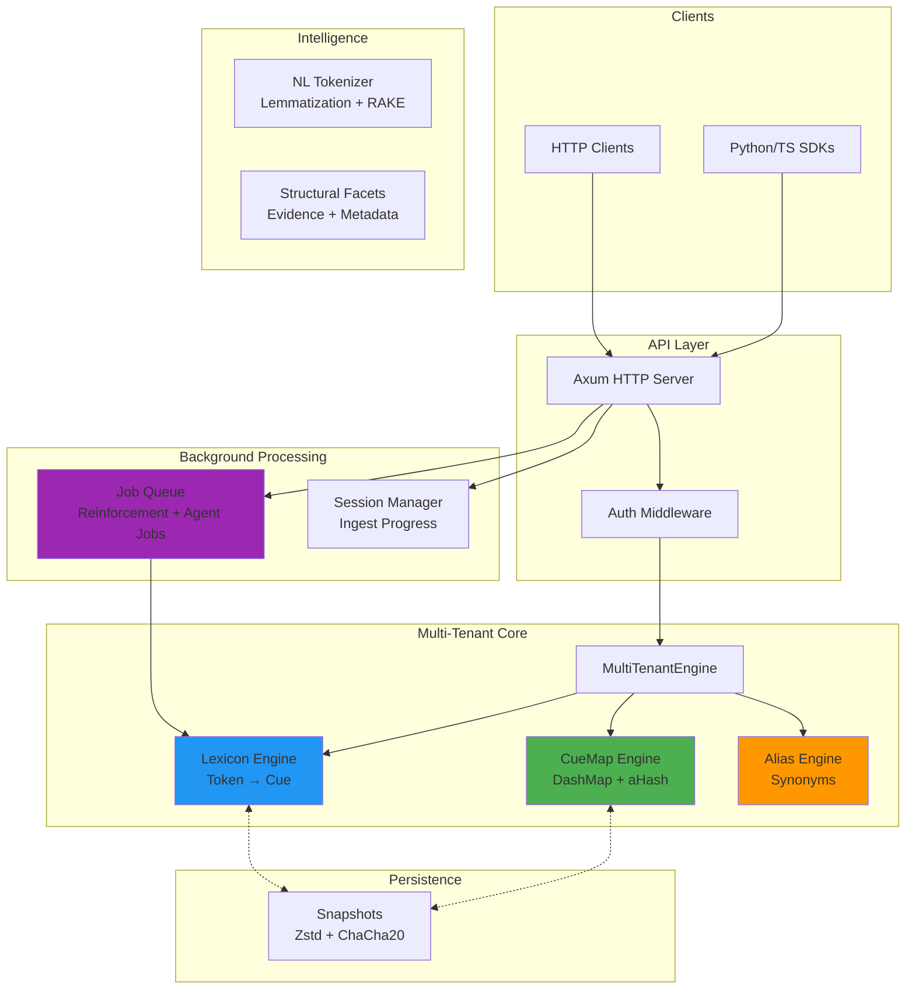
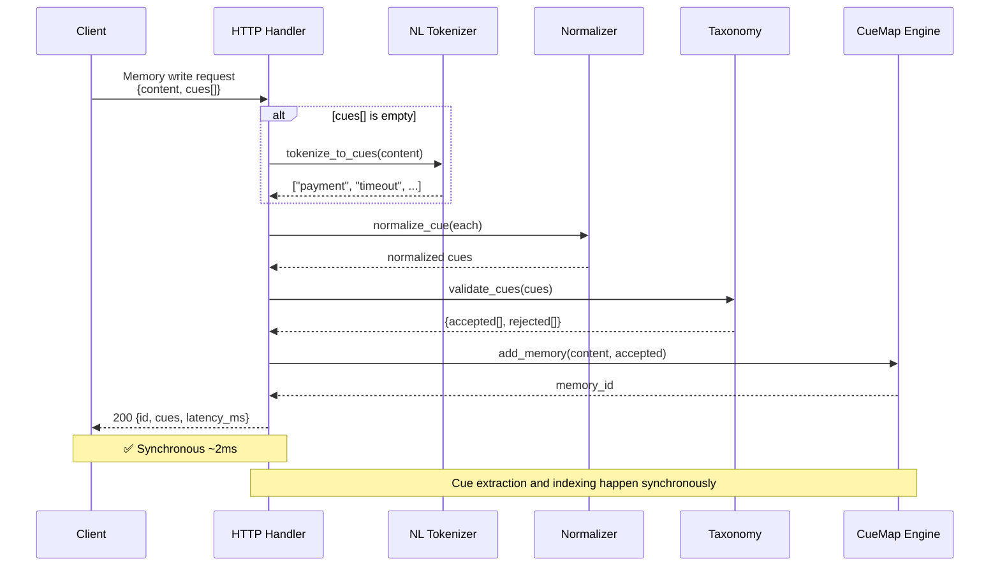
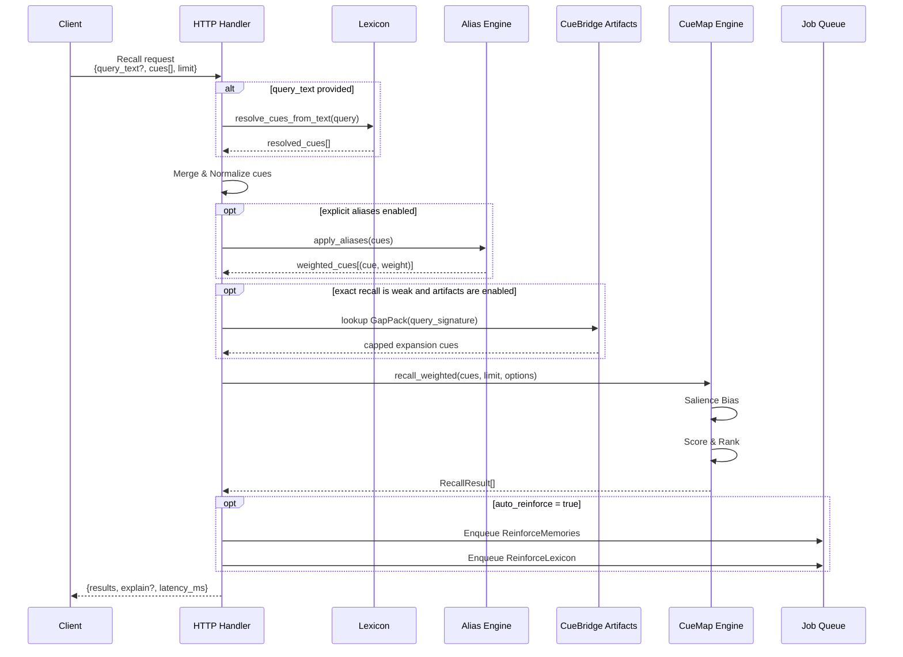
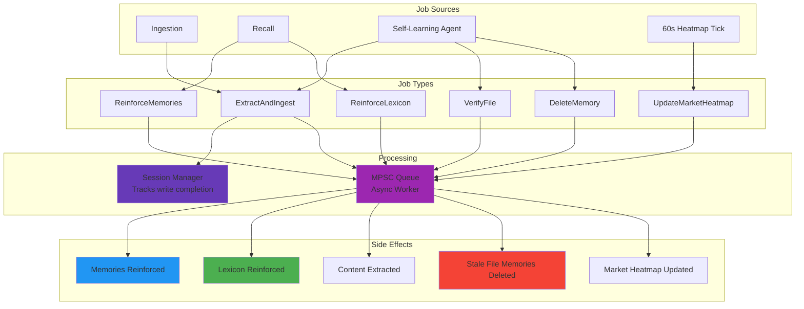

# CueMap Rust Engine Architecture

This document contains the system architecture diagrams for the CueMap Rust Engine. It covers the high-level component layout, synchronous write and read flows, and the background job pipeline.

## System Architecture

### 1. High-Level Overview

### 2. Write Flow

### 3. Read Flow

### 4. Background Job Pipeline

