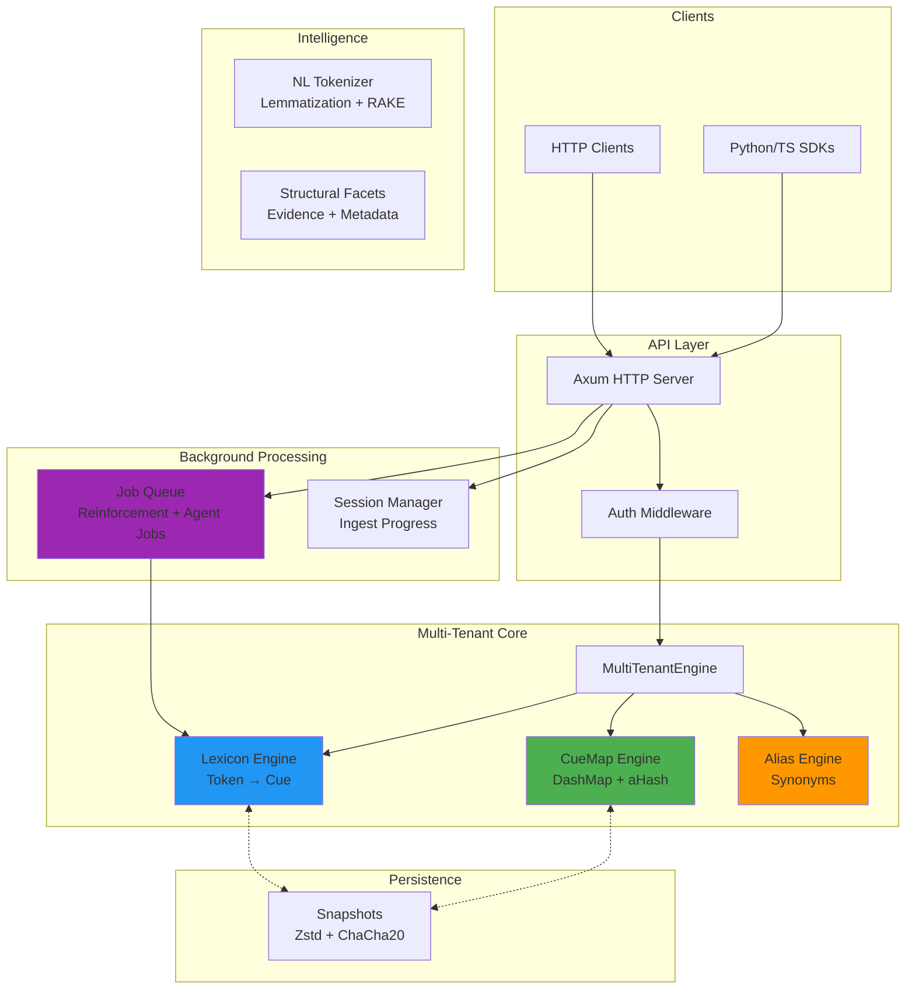
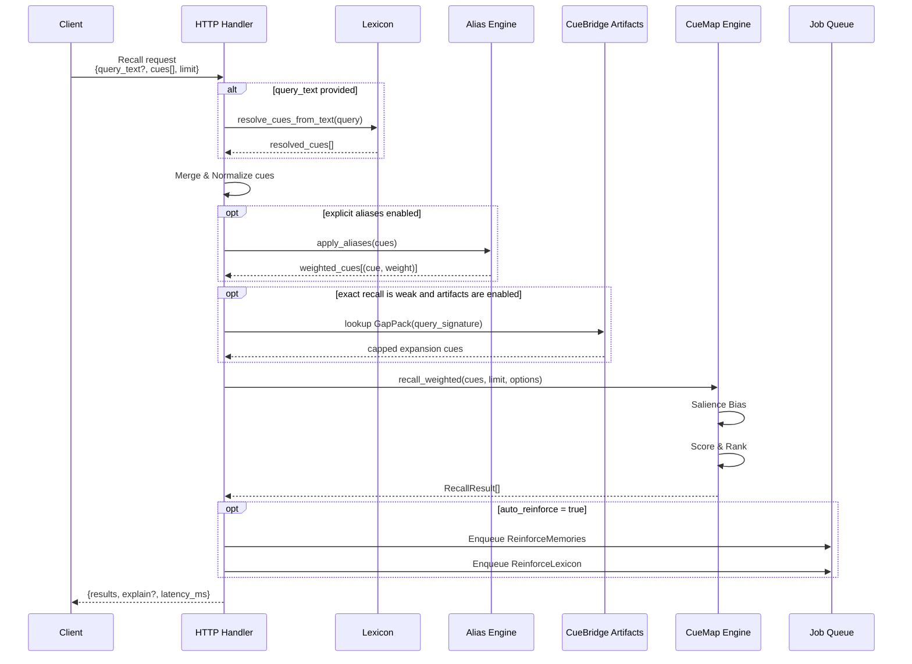
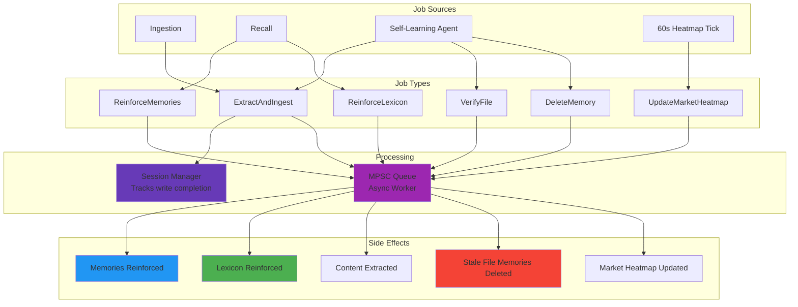

# CueMap Rust Engine

[](https://github.com/cuemap-dev/cuemap/actions/workflows/coverage.yml)
[](https://app.codecov.io/github/cuemap-dev/cuemap)

**High-performance temporal-associative memory store** designed for dynamic contextual retrieval.

## Overview

CueMap implements a **Continuous Gradient Algorithm** optimized for associative data structures:

1.  **Intersection (Context Filter)**: Triangulates relevant memories by overlapping cues
2.  **Structural Extraction**: Emits deterministic cues for observable evidence such as dates, numbers, lists, source metadata, and surface entities.
3.  **Recency & Salience (Signal Dynamics)**: Balances fresh data with salient, high-signal events prioritized by an adaptive impact scoring module.
4.  **Reinforcement (Access-based Learning)**: Frequently accessed memories gain signal strength, remaining highly accessible even as they age.
5.  **Sparse Recall**: Uses normalized lexical cues, structural facets, recency, salience, and bounded deterministic reranking.

As of v0.7.2, CueMap's default core path is deterministic and ontology-free. GloVe/Ollama cue generation, WordNet/POS expansion, semantic bridges, pattern completion, external lexicon graphs, context expansion/speculation endpoints, and autonomous consolidation have been removed from the default engine path. v0.7.2 bundles a qint8 `all-MiniLM-L3-v2` vector layer for semantic reranking, intent classification, and query embeddings; the `edge` profile selects a q4 build of the same model. The encoder can still be disabled for constrained builds or deployments.

v0.7.2 also uses numeric per-project memory IDs everywhere. If callers need deterministic upsert/dedupe identity, pass `source_key`; memory IDs remain compact runtime addresses.

Built with Rust for maximum performance and reliability.

## Quick Start

### Build & Run

```bash
# Production (optimized)
cargo build --release
./target/release/cuemap start --port 8080

# Development
cargo run -- start
```

CueMap treats the nlprule tokenizer as a runtime asset, not a build artifact. Set `TOKENIZER_PATH` to a compiled tokenizer `.bin` file, or place `en_tokenizer.bin` under `~/.cuemap/data`. The production Docker image downloads the same checksum-pinned tokenizer used by the install script and packages it at `/app/assets/en_tokenizer.bin`.

### Docker

```bash
docker build -t cuemap/engine:0.7.2 .
docker run -p 8080:8080 -v "$(pwd)/local_snapshot_dir:/app/data" cuemap/engine:0.7.2
```

The container runs as the unprivileged `cuemap` user. Ensure a bind-mounted data directory is writable by UID/GID `10001`, or use a Docker-managed volume. Runtime defaults can be overridden with `CUEMAP_PORT`, `CUEMAP_DATA_DIR`, `CUEMAP_SNAPSHOT_INTERVAL_SECONDS`, `TOKENIZER_PATH`, and `RUST_LOG`.

### Native npm packages

Build the Darwin ARM64, Darwin x64, and Linux x64 native packages without publishing them:

```bash
./scripts/build-npm-native-packages.sh
./scripts/verify-npm-native-packages.sh
```

The packager builds Linux on Debian Bookworm for an older glibc baseline, bundles the checksum-pinned tokenizer, and writes package tarballs plus `SHA256SUMS` under `dist/npm-native/tarballs`.

### CLI Commands

CueMap provides a unified CLI for server management, ingestion, and interaction.

Install CLI:

```bash
# Install CLI
cargo install --path . --locked
```

```bash
cuemap <COMMAND> [OPTIONS]
```

#### Core Commands
- **`start`**: Start the CueMap server.
- **`stop`**: Stop the background server instance.
- **`status`**: Check server health, metrics, and background jobs.
- **`logs`**: View or tail server logs.

#### Interaction
- **`add`**: Add a memory via natural language.
- **`recall`**: Search memories (supports Grounded Recall and Web Recall).
- **`ingest`**: Ingest data from files or URLs.
- **`projects`**: Create and list projects.
- **`set-project`**: Set the default project for the current session.
- **`set-watch-dir`**: Set a watch directory for a project (enables agent).

#### Deterministic Semantics
- **`lexicon`**: Inspect lexicon entries and wire/unwire cues.
- **`alias`**: Manage explicit deterministic aliases.

Hint: Use `cuemap --help` to see available commands and options.

## Configuration

CueMap uses a layered configuration system that prioritizes settings in the following order:
**CLI Args** > **Env Vars** > **`server_config.toml`** > **Defaults**.

This system allows you to:
1.  **Centralize Settings**: Manage server options, security keys, and engine tuning in `~/.cuemap/server_config.toml`.
2.  **Fine-Tune Performance**: Adjust critical engine parameters like scoring weights, scan limits, and bounded fallback thresholds via the `[tuning]` section without recompiling.
3.  **Manage Project Context**: Use `set-watch-dir` to persist project-specific settings (like agent watch paths) in `.meta.json` files alongside your data.

## Self-Learning Agent (Zero-Friction Ingestion)

CueMap includes a **Self-Learning Agent** that automatically watches local directories, extracts structured "facts", and ingests them into your memory store.

### Automated Bootstrapping

On startup, if `--agent-dir` is provided, CueMap initializes the **Self-Learning Agent**.

### Example

```bash
# Point CueMap at your project
./target/release/cuemap start --agent-dir ~/projects/my-app

# The agent will automatically:
# 1. Supercharged Structural Ingestion (Rust, Python, Go, JS/TS, PHP, Java).
#    - Native tree-sitter queries capture definitions, calls, and imports as grounded cues.
# 2. Document & Data Parsing (PDF, Word, Excel, JSON, CSV, YAML, XML).
#    - Extracts headers, keys, and metadata as structural metadata.
# 3. Source-aware chunking: related chunks share stable parent/session/order metadata for optional bounded reconstruction during recall.
```

## AI Agent Integration (MCP Server)

CueMap provides a native Model Context Protocol (MCP) server, allowing AI coding assistants (like Claude Desktop, Cursor, and Windsurf) to instantly recall codebase context using the engine.

### Setup

We provide a zero-config NPM package that automatically downloads and manages the CueMap background engine.

Add the MCP server to your AI agent's configuration (e.g., Claude Desktop, Cursor, or Windsurf):
```json
{
  "mcpServers": {
    "cuemap": {
      "command": "npx",
      "args": [
        "-y",
        "cuemap-mcp"
      ],
      "env": {
        "CUEMAP_PORT": "8080"
      }
    }
  }
}
```

Once configured, the AI Agent can use the `cuemap_init` and `cuemap_recall` tools to query your codebase memories natively. There is no need to manually start the engine.

## Project Management & Persistence

CueMap provides complete project isolation with automatic persistence:

### Features

- **Project Isolation**: Each project has its own memory space, identified by `X-Project-ID` header.
- **Auto-Save on Shutdown**: All projects are saved on graceful shutdown when persistence is enabled.
- **Auto-Load on Startup**: Snapshots are restored from the configured data directory when persistence is enabled.
- **Zero Configuration**: Works out of the box

### Usage

CueMap runs in multi-tenant mode by default. Select a project for CLI commands with `cuemap set-project` or pass `--project` to an individual command.

```bash
# Start the server
./target/release/cuemap start --port 8080

# Choose a project and use the local CLI
cuemap set-project my-project
cuemap add "Important data"
cuemap recall "What is important?"

# Stop server (Ctrl+C) - saves all projects when persistence is enabled
# Restart server - loads persisted snapshots
# Data persists across restarts unless snapshots are disabled.
```

### Snapshot Management

Snapshots are automatically managed:
- **Created**: Periodically and on graceful shutdown (SIGINT/Ctrl+C) when persistence is enabled.
- **Loaded**: On server startup
- **Disabled**: `--disable-snapshots` turns off periodic and shutdown snapshot saves.
- **Location**: `~/.cuemap/data/snapshots/` by default, or `<--data-dir>/snapshots` when `--data-dir` is set. Older installs may also be discovered under the legacy sibling `snapshots/` directory.
- **Format**: zstd-compressed JSON inside `.bin` files. This preserves arbitrary metadata reliably while keeping snapshots compact; older uncompressed bincode snapshots remain readable when their metadata can be decoded.
- **Migration note**: Some pre-v0.7.2 bincode snapshots that contain dynamic JSON metadata cannot be decoded by bincode's `deserialize_any` limitation. Those projects are reported at startup and must be reingested or exported from a compatible older binary before upgrading.
- **Files**: `{project-id}.bin`, `{project-id}_lexicon.bin`, `{project-id}_aliases.bin`

### Cloud Backup

CueMap supports secure offsite backups to AWS S3, Google Cloud Storage, and Azure Blob Storage.

**Configuration**:
Enable cloud backup via CLI flags or `~/.cuemap/server_config.toml`.

```bash
# S3 Example
./target/release/cuemap start \
  --cloud-backup s3 \
  --cloud-bucket my-backup-bucket \
  --cloud-region us-east-1
```

**Supported Providers**:
- `s3`: AWS S3 or compatible (MinIO, DigitalOcean Spaces)
- `gcs`: Google Cloud Storage
- `azure`: Azure Blob Storage
- `local`: Local path (for testing/replication)

**Management**:
Manual backup operations are documented in the [HTTP API reference](https://cuemap.dev/docs/api-reference).


## Authentication

Secure your CueMap instance with API key authentication.

### Enable Authentication

Set an API key via environment variable:

```bash
# Single API key
CUEMAP_API_KEY=your-secret-key ./target/release/cuemap start --port 8080

# Multiple API keys (comma-separated)
CUEMAP_API_KEYS=key1,key2,key3 ./target/release/cuemap start --port 8080
```

Or configure keys in `~/.cuemap/server_config.toml`:

```toml
[security]
api_keys = ["your-secret-key"]
```

Clients send the configured key in the `X-API-Key` header. See the [HTTP API reference](https://cuemap.dev/docs/api-reference) for request headers and SDK examples.

### Docker with Authentication

```bash
docker run -p 8080:8080 -v "$(pwd)/local_snapshot_dir:/app/data" \
  -e CUEMAP_API_KEY=your-secret-key \
  cuemap/engine
```

### Security Notes

- Authentication is **disabled by default** (no keys = no auth required, unless `security.require_auth=true` is set in config)
- Keys can be loaded from `security.api_keys` in `~/.cuemap/server_config.toml` or from `CUEMAP_API_KEY` / `CUEMAP_API_KEYS`.
- Use strong, randomly generated keys in production
- Rotate keys regularly
- Use HTTPS in production to protect keys in transit

## Encryption

CueMap supports **encryption-at-rest** for all memory content using modern authenticated encryption.

- **Algorithm**: ChaCha20-Poly1305 (IETF) (via `chacha20poly1305` crate).
- **Master Key**: Uses a 256-bit (32-byte) key for encryption.
- **Key Derivation (PBKDF2)**: Supports deriving the master key from a human-readable passphrase using PBKDF2-HMAC-SHA256 with 100,000 iterations and a persistent installation-unique salt.
- **Nonce**: A random 12-byte nonce is generated for every memory encryption operation and stored alongside the ciphertext.
- **Key Handling**: The engine does not write the master key into CueMap data files. Encryption-at-rest is opt-in and the key must be provided at startup via environment variables (`CUEMAP_MASTER_KEY` or `CUEMAP_MASTER_PASSWORD`) or `security.master_key` in the configuration file. If you store the key in `server_config.toml`, protect that file like any other secret.

## Compression

To optimize storage efficiency, especially for large textual memories, CueMap employs transparent compression.

- **Algorithm**: Zstandard (Zstd), configured for a balanced compression level (3).
- **Strategy**: Content is compressed *before* encryption. This ensures maximum entropy reduction before the data is scrambled, often resulting in 40-60% storage savings for English text.
- **Performance**: Zstd provides extremely fast decompression speeds, ensuring that the "hot path" for reading memories remains sub-millisecond even with compression enabled.

## Performance

### Benchmark Results (v0.7.2)

Tests performed on **Real-World Data** (Wikipedia Articles), processing full natural language sentences with the complete NLP pipeline.

**Hardware:** MacBook Pro M-series, 64GB RAM, single node. The v0.7.2 release table below records completed lexical and hybrid runs at 10K, 100K, and 1M memories. Lexical runs isolate the sparse core with the semantic encoder disabled; hybrid runs include the bundled local encoder. P95 is the release headline percentile, while P99 remains available in the JSON diagnostics.

#### Benchmark Methodology

The NL benchmark script lives at `benchmarks/benchmark_nl.py`.

Benchmark setup:
- Uses the public [Wikipedia Plaintext (2023-07-01) Kaggle dataset](https://www.kaggle.com/datasets/jjinho/wikipedia-20230701) as the release corpus. The benchmark script downloads it automatically when `--wikipedia-path` is omitted, caches it under `~/.cache/cuemap/benchmarks/wikipedia-20230701`, and samples parquet files with a `text` column. Install the downloader first with `python -m pip install kagglehub`; configure Kaggle access if Kaggle prompts for authentication. To avoid the download or use another corpus, pass `--wikipedia-path /path/to/parquet-or-directory`.
- Deduplicates sampled snippets and consumes them without replacement, so 100K and 1M write runs do not reuse the same text.
- Writes use HTTP `POST /memories` with `minimal_response=true` and no explicit cues, forcing CueMap to run deterministic cue/facet extraction and indexing.
- Reads generate keyword-style natural-language queries from retained ingested snippets.
- Recall numbers use the script's lean recall mode: `semantic_mode=lexical`, `auto_reinforce=false`, salience disabled, alias expansion disabled, CueBridge artifacts disabled, `depth=1`, `expansion_depth=1`, and parent/order/evidence reconstruction disabled. This isolates the core sparse recall path from the bundled semantic encoder and reranker.
- Each requested size runs in its own run-scoped project, so a 1M pass is not layered on top of a previous 100K pass or stale state from an earlier invocation.
- `--trace-timing` records engine timing breakdowns but is not required for throughput measurements.

Example run with the checked-in release fixture:

```bash
CUEMAP_SEMANTIC_ENCODER_ENABLED=false cuemap start --disable-snapshots --disable-bg-jobs

python benchmarks/benchmark_nl.py \
  --sizes 10000,100000,1000000 \
  --project-id nl_test \
  --semantic-mode lexical \
  --wiki-reservoir-size 20000 \
  --query-sample-size 5000 \
  --payload-buffer-size 500
```

Restart the engine without `CUEMAP_SEMANTIC_ENCODER_ENABLED=false`, then run the
same command with `--semantic-mode hybrid` to produce the hybrid comparison. The
dataset is downloaded only once and reused from the local cache on subsequent
runs.

#### v0.7.2 latency comparison

The lexical release rerun now covers 10K, 100K, and 1M writes plus lean recall
queries. The compact comparison below records the 10K, 100K, and 1M hybrid
runs as well.

| Mode | Write avg | Write P50 | Write P95 | Write throughput | Read avg | Read P50 | Read P95 | Read throughput |
|:---|---:|---:|---:|---:|---:|---:|---:|---:|
| Lexical | 2.13 ms | 1.88 ms | 4.13 ms | 470 ops/s | 1.05 ms | 1.01 ms | 1.60 ms | 939 ops/s |
| Hybrid | 11.52 ms | 10.38 ms | 17.45 ms | 87 ops/s | 6.54 ms | 6.80 ms | 8.41 ms | 152 ops/s |

The script still stores p99 in the JSON result for diagnostics, but p95 is the
headline percentile used by the console output and release chart.

| Hybrid scale | Write avg | Write P50 | Write P95 | Write throughput | Read avg | Read P50 | Read P95 | Read throughput |
|:---|---:|---:|---:|---:|---:|---:|---:|---:|
| **10,000** | 11.52 ms | 10.38 ms | 17.45 ms | 87 ops/s | 6.54 ms | 6.80 ms | 8.41 ms | 152 ops/s |
| **100,000** | 11.21 ms | 10.27 ms | 16.43 ms | 89 ops/s | 6.94 ms | 7.14 ms | 8.83 ms | 144 ops/s |
| **1,000,000** | 11.28 ms | 10.38 ms | 16.81 ms | 89 ops/s | 8.36 ms | 8.12 ms | 10.67 ms | 119 ops/s |

#### 1. Ingestion (Write) Performance — lexical
*Measures HTTP ingestion, deterministic cue/facet extraction, memory allocation, and indexing.*

| Dataset Scale | Avg Latency | P50 | P95 | Throughput |
|:---|:---|:---|:---|:---|
| **10,000** | 2.13 ms | 1.88 ms | 4.13 ms | 470 ops/s |
| **100,000** | 2.92 ms | 2.41 ms | 5.70 ms | 343 ops/s |
| **1,000,000** | 3.33 ms | 2.74 ms | 6.18 ms | 301 ops/s |

Write latency remains mostly flat with project size; the dominant cost is per-memory extraction/indexing rather than corpus scan time.

#### 2. Recall (Read) Performance — lexical
*Measures the time to parse a query, resolve deterministic cues, and score sparse candidate intersections.*

| Dataset Scale | Avg Latency | P50 | P95 | Throughput |
|:---|:---|:---|:---|---:|
| **10,000** | 1.05 ms | 1.01 ms | 1.60 ms | 939 ops/s |
| **100,000** | 1.86 ms | 1.71 ms | 3.16 ms | 535 ops/s |
| **1,000,000** | 2.63 ms | 2.06 ms | 3.72 ms | 378 ops/s |

**Key Metrics**:
- **Low-latency recall:** The lexical v0.7.2 1M run measured 2.63ms average with 3.72ms p95; hybrid measurements remain separate because they include bundled encoder work.
- **Numeric ID memory reduction:** 1M in-memory footprint dropped from about 5.25GB to about 1.93GB after the v0.7 numeric memory-ID refactor.
- **Controlled hot path:** the release benchmark disables the local semantic encoder, LLMs, network services, and disk scans; normal v0.7.2 hybrid recall can use the bundled local encoder for bounded reranking.

## Architecture

### Core Components

- **Axum**: Minimal overhead async web framework
- **DashMap + aHash**: Lock-free concurrent hash map with high-speed hashing
- **IndexSet**: O(1) move-to-front operations
- **Bincode**: Fast binary serialization for persistence
- **Zstd**: High-ratio, real-time compression for storage
- **ChaCha20-Poly1305**: Authenticated encryption at rest

### Optimizations

- **Zero-copy**: Efficient memory management with Arc
- **Pre-allocated collections**: Capacity hints eliminate reallocation
- **Unstable sorting**: 2-3x faster than stable sort
- **Iterative deepening**: Early termination on hot paths

## HTTP API and SDK documentation

The complete HTTP/OpenAPI contract, request and response schemas, authentication headers, ingestion and recall routes, and Python/TypeScript SDK examples live in the [CueMap documentation](https://cuemap.dev/docs/api-reference).

- [Quick start and operations](https://cuemap.dev/docs/)
- [HTTP API reference](https://cuemap.dev/docs/api-reference)
- [OpenAPI 3.1 schema](https://cuemap.dev/openapi.yml)

The website docs are the source of truth for endpoint behavior and are kept aligned with the checked-in Rust router. This README stays focused on building, operating, and understanding the engine; use the CLI and MCP sections above for the fastest local workflows.

## System Architecture

### 1. High-Level Overview


```mermaid
graph TB
    subgraph "Clients"
        SDK[Python/TS SDKs]
        CURL[HTTP Clients]
    end
    
    subgraph "API Layer"
        AXUM[Axum HTTP Server]
        AUTH[Auth Middleware]
    end
    
    subgraph "Multi-Tenant Core"
        MT[MultiTenantEngine]
        MAIN[CueMap Engine<br/>DashMap + aHash]
        LEX[Lexicon Engine<br/>Token → Cue]
        ALIAS[Alias Engine<br/>Synonyms]
    end
    
    subgraph "Background Processing"
        QUEUE[Job Queue<br/>Reinforcement + Agent Jobs]
        SESSION[Session Manager<br/>Ingest Progress]
    end
    
    subgraph "Intelligence"
        NL[NL Tokenizer<br/>Lemmatization + RAKE]
        STRUCT[Structural Facets<br/>Evidence + Metadata]
    end
    
    subgraph "Persistence"
        PERSIST[Snapshots<br/>Zstd + ChaCha20]
    end
    
    SDK --> AXUM
    CURL --> AXUM
    AXUM --> AUTH --> MT
    
    MT --> MAIN
    MT --> LEX
    MT --> ALIAS
    
    AXUM --> QUEUE
    AXUM --> SESSION
    
    QUEUE --> LEX
    
    MAIN <-.-> PERSIST
    LEX <-.-> PERSIST
    
    style MAIN fill:#4CAF50
    style LEX fill:#2196F3
    style ALIAS fill:#FF9800
    style QUEUE fill:#9C27B0
```

### 2. Write Flow


```mermaid
sequenceDiagram
    participant C as Client
    participant API as HTTP Handler
    participant NL as NL Tokenizer
    participant Norm as Normalizer
    participant Tax as Taxonomy
    participant Main as CueMap Engine
    
    C->>API: Memory write request<br/>{content, cues[]}
    
    alt cues[] is empty
        API->>NL: tokenize_to_cues(content)
        NL-->>API: ["payment", "timeout", ...]
    end
    
    API->>Norm: normalize_cue(each)
    Norm-->>API: normalized cues
    
    API->>Tax: validate_cues(cues)
    Tax-->>API: {accepted[], rejected[]}
    
    API->>Main: add_memory(content, accepted)
    Main-->>API: memory_id
    
    API-->>C: 200 {id, cues, latency_ms}
    Note over C,API: ✅ Synchronous ~2ms
    
    Note over API,Main: Cue extraction and indexing happen synchronously
```

### 3. Read Flow


```mermaid
sequenceDiagram
    participant C as Client
    participant API as HTTP Handler
    participant Lex as Lexicon
    participant Alias as Alias Engine
    participant Art as CueBridge Artifacts
    participant Main as CueMap Engine
    participant Q as Job Queue
    
    C->>API: Recall request<br/>{query_text?, cues[], limit}
    
    alt query_text provided
        API->>Lex: resolve_cues_from_text(query)
        Lex-->>API: resolved_cues[]
    end
    
    API->>API: Merge & Normalize cues
    
    opt explicit aliases enabled
        API->>Alias: apply_aliases(cues)
        Alias-->>API: weighted_cues[(cue, weight)]
    end

    opt exact recall is weak and artifacts are enabled
        API->>Art: lookup GapPack(query_signature)
        Art-->>API: capped expansion cues
    end
    
    API->>Main: recall_weighted(cues, limit, options)
    Main->>Main: Salience Bias
    Main->>Main: Score & Rank
    
    Main-->>API: RecallResult[]
    
    opt auto_reinforce = true
        API->>Q: Enqueue ReinforceMemories
        API->>Q: Enqueue ReinforceLexicon
    end
    
    API-->>C: {results, explain?, latency_ms}
```

### 4. Background Job Pipeline


```mermaid
graph TB
    subgraph "Job Sources"
        INGEST[Ingestion]
        RECALL[Recall]
        AGENT[Self-Learning Agent]
        TIMER[60s Heatmap Tick]
    end
    
    subgraph "Job Types"
        J4[ReinforceMemories]
        J5[ReinforceLexicon]
        J7[ExtractAndIngest]
        J8[VerifyFile]
        J10[DeleteMemory]
        J9[UpdateMarketHeatmap]
    end
    
    subgraph "Processing"
        SESSION[Session Manager<br/>Tracks write completion]
        QUEUE[MPSC Queue<br/>Async Worker]
    end
    
    subgraph "Side Effects"
        E1[Memories Reinforced]
        E2[Lexicon Reinforced]
        E4[Content Extracted]
        E5[Stale File Memories Deleted]
        E6[Market Heatmap Updated]
    end
    
    RECALL --> J4 & J5
    INGEST --> J7
    AGENT --> J7 & J8 & J10
    TIMER --> J9
    
    J7 --> SESSION
    J4 & J5 --> QUEUE
    J7 & J8 & J10 --> QUEUE
    J9 --> QUEUE
    
    QUEUE --> E1 & E2 & E4 & E5 & E6
    
    style QUEUE fill:#9C27B0
    style SESSION fill:#673AB7
    style E1 fill:#2196F3
    style E2 fill:#4CAF50
    style E5 fill:#F44336
```

## Advanced Capabilities

### 1. Self-Learning Ingestion Agent

The agent transforms your local filesystem into a deterministic structural knowledge base with zero manual effort.

*   **Universal Format Support**: Deeply integrates with dozens of formats:
    *   **Languages**: Rust, Python, TypeScript, Go, Java, PHP, HTML, CSS (via Tree-sitter).
    *   **Documents**: PDF (text extraction), Word (DOCX), Excel (XLSX).
    *   **Data**: CSV (row-aware), JSON (key-aware), YAML, XML.
*   **Tree-sitter Powered Chunking**: Smartly splits code into functions, classes, and modules while preserving context.
*   **Deterministic Knowledge Extraction**: Uses tree-sitter structure, document parsers, metadata facets, and token normalization; no runtime model call is required.
*   **Idempotent Updates**: Uses content-aware hashing (`file:<path>:<hash>`) to prevent memory duplication and ensure stale memories are pruned.
*   **Background Verification Loop**: Continuously verifies that memories in the engine still exist on disk, pruning stale references automatically.

### 2. Deterministic Natural Language Engine

CueMap bridges unstructured text to sparse deterministic recall without vector search, runtime models, or background semantic expansion by default. Optional vector retrieval can add externally computed semantic candidates without changing the structural extraction path.

#### How It Works

At add-time, CueMap extracts cues synchronously from real structure:

- normalized lexical cues
- surface entity, quote, model-like, and structural evidence cues
- evidence facets such as numbers, money, dates, durations, and lists
- source facets from metadata such as role, channel, session, and order

At query-time, CueMap uses the same deterministic normalization path, then applies only bounded in-memory expansions:

- explicit aliases when enabled
- installed CueBridge AliasPack entries during query cue resolution
- installed CueBridge GapPack entries only when exact recall is weak
- optional ordered/evidence reconstruction passes when explicitly requested

#### Semantic Boundary

CueMap Core does not try to infer broad semantic relationships from local co-occurrence or ontology rules. That keeps the default recall fast, deterministic, and inspectable. Semantic gap closure can come from externally precomputed vectors or explicit artifacts:

- **Manual Lexicon Wiring**: explicit token-to-canonical cue connections for project owners.
- **CueBridge Artifacts**: offline-compiled GapPack/AliasPack files generated by CueBridge Local or Cloud and loaded into CueMap.

This split is intentional: CueMap Core stays lean and latency-stable, while CueBridge can use heavier local or cloud models offline to generate static lexical-gap artifacts.

### 3. Advanced Contextual Recall

CueMap keeps advanced recall behavior deterministic and inspectable:

#### Source-Order Context and Episodes
Long-form ingests, chat logs, files, and agent chunks preserve parent/session/order metadata. Recall can use `expansion_depth` to include nearby source-order chunks, and add-time temporal episode cues can be disabled on memory writes with `disable_temporal_chunking: true`.

#### Adaptive Salience Bias
Not all memories are created equal. The engine calculates a **Salience Multiplier** based on cue density, reinforcement frequency, and rare cue combinations. High-signal memories rank above routine events when other structural evidence is comparable. Can be disabled per-recall via `disable_salience_bias: true`.

#### Match Integrity
Every recall result now includes a **Match Integrity** score. This internal diagnostic combines intersection strength, reinforcement history, and context agreement to tell you how structurally reliable a specific recall result is.

#### Bounded Reconstruction
For long-form chat logs, tickets, transcripts, and benchmark records, recall can optionally run bounded reconstruction passes:

- `parent_fusion`: stitch related chunks that share source parent metadata.
- `ordered_reconstruction`: retrieve ordered evidence from a small number of matching sessions.
- `evidence_coverage`: diversify results across multiple evidence cues for summary-style queries.

These modes are off by default and are designed for diagnostics or workloads that explicitly trade a bounded second pass for higher evidence coverage.

## License

BSL-1.1 (Business Source License 1.1) converting to Apache 2.0 after 4 years.
See `LICENSE` for details.

This allows full use for development, testing, and self-hosting, while preventing the software from being offered as a competing managed Database Service.

For commercial licensing (closed-source SaaS or offering as a service), contact: hello@cuemap.dev
