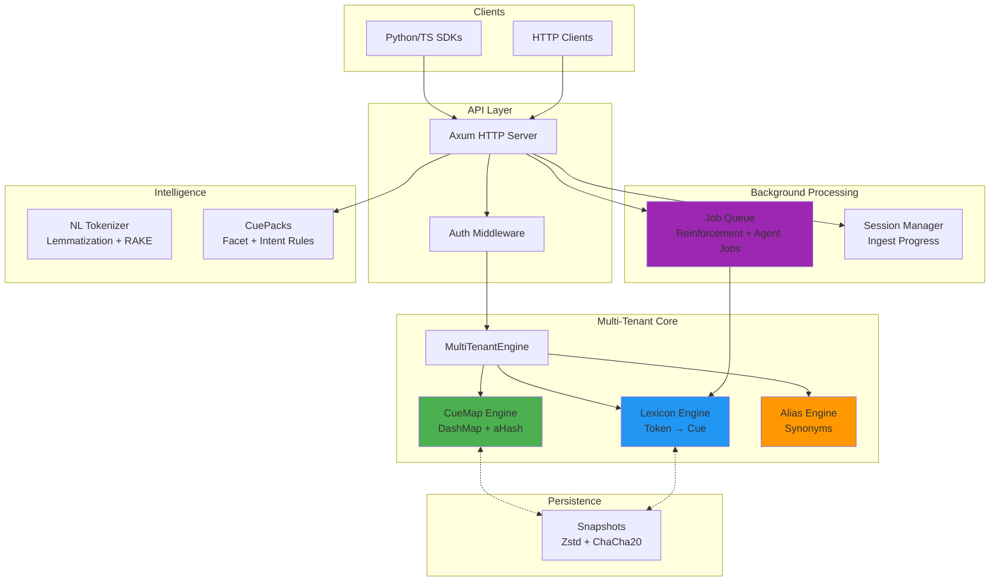
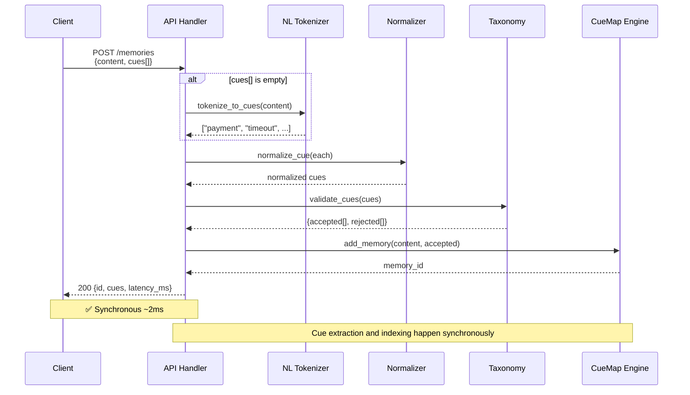
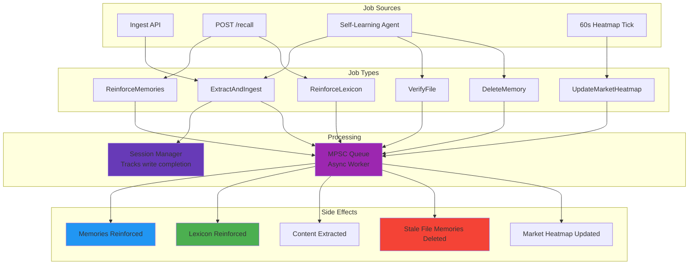

# CueMap Rust Engine

**High-performance temporal-associative memory store** designed for dynamic contextual retrieval.

## Overview

CueMap implements a **Continuous Gradient Algorithm** optimized for associative data structures:

1.  **Intersection (Context Filter)**: Triangulates relevant memories by overlapping cues
2.  **CuePack-Guided Intent Routing**: Uses compiled deterministic rules to add structural facets and weighted intent cues without runtime model calls.
3.  **Recency & Salience (Signal Dynamics)**: Balances fresh data with salient, high-signal events prioritized by an adaptive impact scoring module.
4.  **Reinforcement (Access-based Learning)**: Frequently accessed memories gain signal strength, remaining highly accessible even as they age.
5.  **Deterministic Facets & Intent Routing**: Extracts synchronous source, evidence, temporal, type, and entity facets, then uses sparse intent cues and reranking during recall.

As of v0.7.0, CueMap's core path is deterministic and embedding-free. GloVe/Ollama cue generation, WordNet/POS expansion, semantic bridges, pattern completion, external lexicon graphs, context expansion/speculation endpoints, and autonomous consolidation have been removed from the core engine.

v0.7.0 also uses numeric per-project memory IDs everywhere. If callers need deterministic upsert/dedupe identity, pass `source_key`; memory IDs remain compact runtime addresses.

Built with Rust for maximum performance and reliability.

## Quick Start

### Build & Run

```bash
# Production (optimized)
cargo build --release
./target/release/cuemap start --port 8080

# Development
cargo run -- start
```

CueMap treats the nlprule tokenizer as a runtime asset, not a build artifact. Set `TOKENIZER_PATH` to a compiled tokenizer `.bin` file, or place `en_tokenizer.bin` under `~/.cuemap/data`. The production Docker image downloads the same checksum-pinned tokenizer used by the install script and packages it at `/app/assets/en_tokenizer.bin`.

### Docker

```bash
docker build -t cuemap/engine:0.7.1 .
docker run -p 8080:8080 -v "$(pwd)/local_snapshot_dir:/app/data" cuemap/engine:0.7.1
```

The container runs as the unprivileged `cuemap` user. Ensure a bind-mounted data directory is writable by UID/GID `10001`, or use a Docker-managed volume. Runtime defaults can be overridden with `CUEMAP_PORT`, `CUEMAP_DATA_DIR`, `CUEMAP_SNAPSHOT_INTERVAL_SECONDS`, `TOKENIZER_PATH`, and `RUST_LOG`.

### Native npm packages

Build the Darwin ARM64, Darwin x64, and Linux x64 native packages without publishing them:

```bash
./scripts/build-npm-native-packages.sh
./scripts/verify-npm-native-packages.sh
```

The packager builds Linux on Debian Bookworm for an older glibc baseline, bundles the checksum-pinned tokenizer, and writes package tarballs plus `SHA256SUMS` under `dist/npm-native/tarballs`.

### CLI Commands

CueMap provides a unified CLI for server management, ingestion, and interaction.

Install CLI:

```bash
# Install CLI
cargo install --path . --locked
```

```bash
cuemap <COMMAND> [OPTIONS]
```

#### Core Commands
- **`start`**: Start the CueMap server.
- **`stop`**: Stop the background server instance.
- **`status`**: Check server health, metrics, and background jobs.
- **`logs`**: View or tail server logs.

#### Interaction
- **`add`**: Add a memory via natural language.
- **`recall`**: Search memories (supports Grounded Recall and Web Recall).
- **`ingest`**: Ingest data from files or URLs.
- **`projects`**: Create and list projects.
- **`set-project`**: Set the default project for the current session.
- **`set-watch-dir`**: Set a watch directory for a project (enables agent).

#### Deterministic Semantics
- **`lexicon`**: Inspect lexicon entries and wire/unwire cues.
- **`alias`**: Manage explicit deterministic aliases.
- **`cuepack`**: List, inspect, and validate deterministic semantic packs.

Hint: Use `cuemap --help` to see available commands and options.

## Configuration

CueMap uses a layered configuration system that prioritizes settings in the following order:
**CLI Args** > **Env Vars** > **`server_config.toml`** > **Defaults**.

This system allows you to:
1.  **Centralize Settings**: Manage server options, security keys, and engine tuning in `~/.cuemap/server_config.toml`.
2.  **Fine-Tune Performance**: Adjust critical engine parameters like scoring weights, scan limits, and bounded fallback thresholds via the `[tuning]` section without recompiling.
3.  **Manage Project Context**: Use `set-watch-dir` to persist project-specific settings (like agent watch paths) in `.meta.json` files alongside your data.

## Self-Learning Agent (Zero-Friction Ingestion)

CueMap includes a **Self-Learning Agent** that automatically watches local directories, extracts structured "facts", and ingests them into your memory store.

### Automated Bootstrapping

On startup, if `--agent-dir` is provided, CueMap initializes the **Self-Learning Agent**.

### Example

```bash
# Point CueMap at your project
./target/release/cuemap start --agent-dir ~/projects/my-app

# The agent will automatically:
# 1. Supercharged Structural Ingestion (Rust, Python, Go, JS/TS, PHP, Java).
#    - Native tree-sitter queries capture definitions, calls, and imports as grounded cues.
# 2. Document & Data Parsing (PDF, Word, Excel, JSON, CSV, YAML, XML).
#    - Extracts headers, keys, and metadata as structural metadata.
# 3. Source-aware chunking: related chunks share stable parent/session/order metadata for optional bounded reconstruction during recall.
```

## AI Agent Integration (MCP Server)

CueMap provides a native Model Context Protocol (MCP) server, allowing AI coding assistants (like Claude Desktop, Cursor, and Windsurf) to instantly recall codebase context using the engine.

### Setup

We provide a zero-config NPM package that automatically downloads and manages the CueMap background engine.

Add the MCP server to your AI agent's configuration (e.g., Claude Desktop, Cursor, or Windsurf):
```json
{
  "mcpServers": {
    "cuemap": {
      "command": "npx",
      "args": [
        "-y",
        "cuemap-mcp"
      ],
      "env": {
        "CUEMAP_PORT": "8080"
      }
    }
  }
}
```

Once configured, the AI Agent can use the `cuemap_init` and `cuemap_recall` tools to query your codebase memories natively. There is no need to manually start the engine.

## Project Management & Persistence

CueMap provides complete project isolation with automatic persistence:

### Features

- **Project Isolation**: Each project has its own memory space, identified by `X-Project-ID` header.
- **Auto-Save on Shutdown**: All projects are saved on graceful shutdown when persistence is enabled.
- **Auto-Load on Startup**: Snapshots are restored from the configured data directory when persistence is enabled.
- **Zero Configuration**: Works out of the box

### Usage

CueMap runs in multi-tenant mode by default. Simply specify a project ID in your requests.

```bash
# Start server
./target/release/cuemap start --port 8080
```

### Example

```bash
# Add memory to project
curl -X POST http://localhost:8080/memories \
  -H "X-Project-ID: my-project" \
  -H "Content-Type: application/json" \
  -d '{"content": "Important data", "cues": ["test"]}'

# Stop server (Ctrl+C) - saves all projects when persistence is enabled
# Restart server - loads persisted snapshots
# Data persists across restarts unless snapshots are disabled.
```

### Snapshot Management

Snapshots are automatically managed:
- **Created**: Periodically and on graceful shutdown (SIGINT/Ctrl+C) when persistence is enabled.
- **Loaded**: On server startup
- **Disabled**: `--disable-snapshots` turns off periodic and shutdown snapshot saves.
- **Location**: `~/.cuemap/data/snapshots/` by default, or `<--data-dir>/snapshots` when `--data-dir` is set.
- **Format**: Bincode binary
- **Files**: `{project-id}.bin`, `{project-id}_lexicon.bin`, `{project-id}_aliases.bin`

### Cloud Backup

CueMap supports secure offsite backups to AWS S3, Google Cloud Storage, and Azure Blob Storage.

**Configuration**:
Enable cloud backup via CLI flags or `~/.cuemap/server_config.toml`.

```bash
# S3 Example
./target/release/cuemap start \
  --cloud-backup s3 \
  --cloud-bucket my-backup-bucket \
  --cloud-region us-east-1
```

**Supported Providers**:
- `s3`: AWS S3 or compatible (MinIO, DigitalOcean Spaces)
- `gcs`: Google Cloud Storage
- `azure`: Azure Blob Storage
- `local`: Local path (for testing/replication)

**Management**:
Backups can be triggered manually via API (`/backup/upload`, `/backup/download`).


## Authentication

Secure your CueMap instance with API key authentication.

### Enable Authentication

Set an API key via environment variable:

```bash
# Single API key
CUEMAP_API_KEY=your-secret-key ./target/release/cuemap start --port 8080

# Multiple API keys (comma-separated)
CUEMAP_API_KEYS=key1,key2,key3 ./target/release/cuemap start --port 8080
```

Or configure keys in `~/.cuemap/server_config.toml`:

```toml
[security]
api_keys = ["your-secret-key"]
```

### Using Authentication

Include the API key in the `X-API-Key` header:

```bash
# Without auth (fails if enabled)
curl http://localhost:8080/stats
# Response: Missing X-API-Key header

# With correct key
curl -H "X-API-Key: your-secret-key" -H "X-Project-ID: default" http://localhost:8080/stats
# Response: {"total_memories": 1000, ...}

# With wrong key
curl -H "X-API-Key: wrong-key" -H "X-Project-ID: default" http://localhost:8080/stats
# Response: Invalid API key
```

### SDK Usage

#### Standard SDKs

Python:
```python
from cuemap import CueMap

# With authentication
client = CueMap(
    url="http://localhost:8080",
    api_key="your-secret-key"
)

client.add("Memory", cues=["test"])
```

TypeScript:
```typescript
import CueMap from 'cuemap';

const client = new CueMap({
  url: 'http://localhost:8080',
  apiKey: 'your-secret-key'
});

await client.add('Memory', ['test']);
```

### Docker with Authentication

```bash
docker run -p 8080:8080 -v "$(pwd)/local_snapshot_dir:/app/data" \
  -e CUEMAP_API_KEY=your-secret-key \
  cuemap/engine
```

### Security Notes

- Authentication is **disabled by default** (no keys = no auth required, unless `security.require_auth=true` is set in config)
- Keys can be loaded from `security.api_keys` in `~/.cuemap/server_config.toml` or from `CUEMAP_API_KEY` / `CUEMAP_API_KEYS`.
- Use strong, randomly generated keys in production
- Rotate keys regularly
- Use HTTPS in production to protect keys in transit

## Encryption

CueMap supports **encryption-at-rest** for all memory content using modern authenticated encryption.

- **Algorithm**: ChaCha20-Poly1305 (IETF) (via `chacha20poly1305` crate).
- **Master Key**: Uses a 256-bit (32-byte) key for encryption.
- **Key Derivation (PBKDF2)**: Supports deriving the master key from a human-readable passphrase using PBKDF2-HMAC-SHA256 with 100,000 iterations and a persistent installation-unique salt.
- **Nonce**: A random 12-byte nonce is generated for every memory encryption operation and stored alongside the ciphertext.
- **Key Handling**: The engine does not write the master key into CueMap data files. Encryption-at-rest is opt-in and the key must be provided at startup via environment variables (`CUEMAP_MASTER_KEY` or `CUEMAP_MASTER_PASSWORD`) or `security.master_key` in the configuration file. If you store the key in `server_config.toml`, protect that file like any other secret.

## Compression

To optimize storage efficiency, especially for large textual memories, CueMap employs transparent compression.

- **Algorithm**: Zstandard (Zstd), configured for a balanced compression level (3).
- **Strategy**: Content is compressed *before* encryption. This ensures maximum entropy reduction before the data is scrambled, often resulting in 40-60% storage savings for English text.
- **Performance**: Zstd provides extremely fast decompression speeds, ensuring that the "hot path" for reading memories remains sub-millisecond even with compression enabled.

## Performance

### Benchmark Results (v0.7.0)

Tests performed on **Real-World Data** (Wikipedia Articles), processing full natural language sentences with the complete NLP pipeline.

**Hardware:** MacBook Pro M-series, 64GB RAM, single node. These are local v0.7 benchmark numbers from the numeric-ID engine.

#### Benchmark Methodology

The NL benchmark script lives at `benchmarks/benchmark_nl.py`.

Benchmark setup:
- Uses Wikipedia parquet files as the source corpus. You can obtain Wikipedia source data from official [Wikimedia dumps](https://dumps.wikimedia.org/) or an Internet Archive mirror, then prepare/extract text into parquet files with a `text` column.
- Deduplicates sampled snippets and consumes them without replacement, so 100K and 1M write runs do not reuse the same text.
- Writes use HTTP `POST /memories` with `minimal_response=true` and no explicit cues, forcing CueMap to run deterministic cue/facet extraction and indexing.
- Reads generate keyword-style natural-language queries from retained ingested snippets.
- Recall numbers use the script's lean recall mode: `auto_reinforce=false`, salience disabled, alias expansion disabled, CueBridge artifacts disabled, `depth=1`, `expansion_depth=1`, and parent/order/evidence reconstruction disabled. This isolates the core sparse recall path.
- `--trace-timing` records engine timing breakdowns but is not required for throughput measurements.

Example run:

```bash
cuemap start --disable-snapshots --disable-bg-jobs

python benchmarks/benchmark_nl.py \
  --sizes 100000,1000000 \
  --project-id nl_test \
  --wikipedia-path /Users/<username>/Downloads/wikipedia/ \
  --trace-timing \
  --wiki-reservoir-size 20000 \
  --query-sample-size 5000 \
  --payload-buffer-size 500
```

#### 1. Ingestion (Write) Performance
*Measures HTTP ingestion, deterministic cue/facet extraction, source-key upsert, and indexing.*

| Dataset Scale | Avg Latency | P50 | P99 | Throughput |
|:---|:---|:---|:---|:---|
| **100,000** | 3.13 ms | 2.56 ms | 10.98 ms | 320 ops/s |
| **1,000,000** | 2.85 ms | 2.39 ms | 11.23 ms | 351 ops/s |

Write latency remains mostly flat with project size; the dominant cost is per-memory extraction/indexing rather than corpus scan time.

#### 2. Recall (Read) Performance
*Measures the time to parse a query, resolve deterministic cues, and score sparse candidate intersections.*

| Dataset Scale | Avg Latency | P50 | P99 |
|:---|:---|:---|:---|
| **100,000** | 1.73 ms | 1.65 ms | 3.67 ms |
| **1,000,000** | 2.70 ms | 2.06 ms | 5.10 ms |

**Key Metrics**:
- **Low-latency recall:** 1M-memory natural-language recall stays around 2.7ms average with about 5.1ms p99 in the current v0.7 run.
- **Numeric ID memory reduction:** 1M in-memory footprint dropped from about 5.25GB to about 1.93GB after the v0.7 numeric memory-ID refactor.
- **Deterministic hot path:** recall uses in-memory sparse indexes and does not call embeddings, LLMs, network services, or disk scans.

## Architecture

### Core Components

- **Axum**: Minimal overhead async web framework
- **DashMap + aHash**: Lock-free concurrent hash map with high-speed hashing
- **IndexSet**: O(1) move-to-front operations
- **Bincode**: Fast binary serialization for persistence
- **Zstd**: High-ratio, real-time compression for storage
- **ChaCha20-Poly1305**: Authenticated encryption at rest

### Optimizations

- **Zero-copy**: Efficient memory management with Arc
- **Pre-allocated collections**: Capacity hints eliminate reallocation
- **Unstable sorting**: 2-3x faster than stable sort
- **Iterative deepening**: Early termination on hot paths

## API

### Deterministic Cue Extraction

CueMap extracts cues synchronously from content and metadata using deterministic tokenization, normalization, facets, aliases, and CuePack rules. The recall path does not call embeddings, LLMs, WordNet, external APIs, or runtime graph expansion.

```bash
# 1. Start CueMap
./target/release/cuemap start

# 2. Add memory in natural language
curl -X POST http://localhost:8080/memories \
  -H "X-Project-ID: default" \
  -H "Content-Type: application/json" \
  -d '{
    "content": "The payments service is down due to a timeout."
  }'
# Deterministic extraction adds normalized lexical cues plus structural/facet cues.
```

## API Reference

### Add Memory

```bash
# Basic manual cues
curl -X POST http://localhost:8080/memories \
  -H "X-Project-ID: default" \
  -H "Content-Type: application/json" \
  -d '{
    "content": "API Rate Limit Policy: 1000/min",
    "cues": ["api", "rate_limit", "policy"],
    "source_key": "doc:api-rate-limit-policy"
  }'

# Deterministic cues are extracted from content when `cues` is omitted or empty
curl -X POST http://localhost:8080/memories \
  -H "X-Project-ID: default" \
  -H "Content-Type: application/json" \
  -d '{
    "content": "The payments service is down due to a timeout."
  }'
```

### Recall Memories

#### Explicit Cues
```bash
curl -X POST http://localhost:8080/recall \
  -H "X-Project-ID: default" \
  -H "Content-Type: application/json" \
  -d '{
    "cues": ["api", "rate_limit"],
    "limit": 10
  }'
```

#### Natural Language Search (Symbol-First Intent Routing)
```bash
curl -X POST http://localhost:8080/recall \
  -H "X-Project-ID: default" \
  -H "Content-Type: application/json" \
  -d '{
    "query_text": "where is process_data used?",
    "limit": 10,
    "expansion_depth": 2
  }'
```
Returns surgical code recall. The engine uses a deterministic **Symbol-First Router** with sparse BM25-style scoring to convert fuzzy queries into structural cues (e.g., `calls_function:process_data`). Set `expansion_depth` above 1 to include nearby source-order chunks when session/order metadata is available.

```json
{
  "explain": {
    "query_cues": ["payments"],
    "expanded_cues": [
      ["payments", 1.0],
      ["service:payments", 0.85]
    ]
  },
  "results": [
    {
      "content": "...",
      "score": 145.2,
      "explain": {
        "intersection_weighted": 1.85,
        "recency_component": 0.5
      }
    }
  ]
}
```

### Reinforce Memory

```bash
curl -X PATCH http://localhost:8080/memories/{id}/reinforce \
  -H "X-Project-ID: default" \
  -H "Content-Type: application/json" \
  -d '{
    "cues": ["important", "urgent"]
  }'
```
Reinforcement is used to boost the relevance of a memory. It is a way to tell CueMap that a memory is important and should be recalled more often. Standard `POST /recall` requests do not auto-reinforce by default; enable `auto_reinforce` explicitly or reinforce a memory manually through the API.

### Get Memory

```bash
curl -H "X-Project-ID: default" http://localhost:8080/memories/{id}
```

### Get Stats
```bash
curl -H "X-Project-ID: default" http://localhost:8080/stats
```

### Alias Management

Manage synonyms and semantic mappings deterministically.

#### Add Alias
```bash
curl -X POST http://localhost:8080/aliases \
  -H "X-Project-ID: default" \
  -H "Content-Type: application/json" \
  -d '{
    "from": "pay",
    "to": "service:payment",
    "weight": 0.9
  }'
```

#### Merge Aliases (Bulk)
```bash
curl -X POST http://localhost:8080/aliases/merge \
  -H "X-Project-ID: default" \
  -H "Content-Type: application/json" \
  -d '{
    "cues": ["bill", "invoice", "statement"],
    "to": "service:billing"
  }'
```

#### Get Aliases
```bash
# Reverse lookup: Find all aliases for "service:payment"
curl -H "X-Project-ID: default" "http://localhost:8080/aliases?cue=service:payment"
```

### Project Management

#### Create Project
```bash
curl -X POST http://localhost:8080/projects \
  -H "Content-Type: application/json" \
  -d '{"project_id": "my-project"}'
```

#### List Projects
```bash
curl http://localhost:8080/projects
```

#### Delete Project
```bash
curl -X DELETE "http://localhost:8080/projects/default"
```

### Lexicon Management

#### Inspect Cue
View incoming tokens and manually wired canonical cue mappings.
```bash
curl "http://localhost:8080/lexicon/inspect/service:payment"
```

#### Wire Token (Manual Connection)
Manually connect a token to a canonical cue.
```bash
curl -X POST http://localhost:8080/lexicon/wire \
  -H "Content-Type: application/json" \
  -d '{
    "token": "stripe",
    "canonical": "service:payment"
  }'
```

#### Unwire/Delete Entry
Remove a specific token from the lexicon.
```bash
curl -X DELETE "http://localhost:8080/lexicon/entry/cue:stripe"
```

### CuePacks

CuePacks are deterministic semantic packages. They are the maintainable place for domain vocabulary, semantic phrase families, facet rules, query-intent rules, aliases, and policy metadata. CuePacks are compiled at startup or request setup; recall does not call a network service, run embeddings, scan raw memory content, or read pack files from disk.

Bundled defaults are enabled unless disabled. Place custom packs in `~/.cuemap/cuepacks/` as TOML files and inspect them with:

```bash
cuemap cuepack list
cuemap cuepack inspect memory-general
cuemap cuepack validate ./my-domain-pack.toml
```

Select packs per request:

```bash
cuemap recall -p my_project --cuepacks memory-general "which transit app did I use?"
cuemap recall -p my_project --disable-default-cuepacks "core-only recall"
```

API requests accept a separate `cuepacks` field. Use `["off"]` for core-only behavior, omit the field for bundled defaults, or pass explicit pack names.

### CueBridge Artifacts

CueBridge artifacts are offline-compiled lexical-gap packages. CueMap loads them into memory and uses them deterministically during recall:

- **AliasPack**: safe lexical variants applied during query cue resolution.
- **GapPack**: gated expansion cues applied only when exact recall is weak.

Install artifacts into the project artifact directory, then reload them:

```bash
curl -X POST http://localhost:8080/projects/my-project/artifacts
```

Inspect active artifacts:

```bash
curl http://localhost:8080/projects/my-project/artifacts
```

Recall can disable installed artifacts for baseline checks:

```bash
cuemap recall -p my_project --disable-cuebridge-artifacts "what foundation did we choose?"
```

### Cloud Backup Management

#### Upload Snapshot
```bash
curl -X POST http://localhost:8080/backup/upload \
  -H "Content-Type: application/json" \
  -d '{"project_id": "default"}'
```

#### Download Snapshot
```bash
curl -X POST http://localhost:8080/backup/download \
  -H "Content-Type: application/json" \
  -d '{"project_id": "default"}'
```

#### List Backups
```bash
curl http://localhost:8080/backup/list
```

### Monitoring

#### Prometheus Metrics
Exposes internal system metrics for scraping (Prometheus format).

```bash
curl http://localhost:8080/metrics
# Output:
# cuemap_ingestion_rate 120.0
# cuemap_recall_latency_p99 0.8
# cuemap_memory_usage_bytes 1024
# ...
```

### Ingestion

#### Ingest URL
Extract content from a web page and ingest it.
```bash
curl -X POST http://localhost:8080/ingest/url \
  -H "X-Project-ID: default" \
  -H "Content-Type: application/json" \
  -d '{
    "url": "https://example.com"
  }'
```

#### Ingest Raw Content
Ingest text directly, simulating a file.
```bash
curl -X POST http://localhost:8080/ingest/content \
  -H "X-Project-ID: default" \
  -H "Content-Type: application/json" \
  -d '{
    "content": "The quick brown fox jumps over the lazy dog.",
    "filename": "fox.txt"
  }'
```

#### Ingest File (Multipart)
Upload a file for processing by the Agent (supports Text, PDF, JSON, etc. if Agent is configured).
```bash
curl -X POST http://localhost:8080/ingest/file \
  -H "X-Project-ID: default" \
  --form "file=@/path/to/document.pdf"
```

#### Grounded Recall (Budgeted)

```bash
curl -X POST http://localhost:8080/recall/grounded \
  -H "X-Project-ID: default" \
  -H "Content-Type: application/json" \
  -d '{
    "query_text": "Why is the server down?",
    "token_budget": 500,
    "limit": 10
  }'
```

Grounded recall deterministically fills a token budget with the highest-scoring memories and returns a context block designed to be passed to an LLM alongside a structured proof.

Grounded recall enables `auto_reinforce` by default; set `"auto_reinforce": false` for read-only evaluation or benchmark runs.

**Response** (example with Ed25519 signing configured):
```json
{
  "verified_context": "[VERIFIED CONTEXT] (1) Fact... Rules:...",
  "proof": {
    "trace_id": "966579b1-...",
    "selected": [...],
    "excluded_top": [...]
  },
  "signature_alg": "ed25519",
  "signature": "9b2d...",
  "public_key": "ed25519:4f8c...",
  "engine_latency_ms": 0.83
}
```

### Signed Context (Immutable RAG)

CueMap can sign grounded recall context so clients can verify that the `verified_context` block was produced by the configured CueMap server and was not modified in transit before it reaches an LLM.

Preferred setup uses Ed25519 asymmetric signatures. Generate one 32-byte private seed, store it securely, and reuse it across restarts:

```bash
openssl rand -hex 32 > ~/.cuemap/signing_ed25519_seed.hex
CUEMAP_SIGNING_PRIVATE_KEY="$(cat ~/.cuemap/signing_ed25519_seed.hex)" cuemap start
```

Or configure it in `~/.cuemap/server_config.toml`:

```toml
[security]
signing_private_key = "ed25519:<32-byte-hex-seed>"
```

Grounded recall responses include the signature algorithm and public key:

```json
{
  "verified_context": "...",
  "signature_alg": "ed25519",
  "signature": "9b2d...",
  "public_key": "ed25519:4f8c..."
}
```

Clients verify `signature` over the exact UTF-8 bytes of `verified_context` using the pinned Ed25519 public key. The signature is a lowercase hex-encoded 64-byte Ed25519 signature. The public key is `ed25519:` plus the lowercase hex-encoded raw 32-byte Ed25519 public key.

Treat the response `public_key` as discovery metadata; production clients should pin the expected public key from deployment config rather than trusting a key delivered by the same response they are verifying.

For compatibility, `CUEMAP_SECRET_KEY` still enables legacy `hmac-sha256` signatures. HMAC verification requires sharing the same secret with verifiers, so Ed25519 is recommended for client-side or third-party verification.

## System Architecture

### 1. High-Level Overview


```mermaid
graph TB
    subgraph "Clients"
        SDK[Python/TS SDKs]
        CURL[HTTP Clients]
    end
    
    subgraph "API Layer"
        AXUM[Axum HTTP Server]
        AUTH[Auth Middleware]
    end
    
    subgraph "Multi-Tenant Core"
        MT[MultiTenantEngine]
        MAIN[CueMap Engine<br/>DashMap + aHash]
        LEX[Lexicon Engine<br/>Token → Cue]
        ALIAS[Alias Engine<br/>Synonyms]
    end
    
    subgraph "Background Processing"
        QUEUE[Job Queue<br/>Reinforcement + Agent Jobs]
        SESSION[Session Manager<br/>Ingest Progress]
    end
    
    subgraph "Intelligence"
        NL[NL Tokenizer<br/>Lemmatization + RAKE]
        PACKS[CuePacks<br/>Facet + Intent Rules]
    end
    
    subgraph "Persistence"
        PERSIST[Snapshots<br/>Zstd + ChaCha20]
    end
    
    SDK --> AXUM
    CURL --> AXUM
    AXUM --> AUTH --> MT
    
    MT --> MAIN
    MT --> LEX
    MT --> ALIAS
    
    AXUM --> QUEUE
    AXUM --> SESSION
    
    QUEUE --> LEX
    AXUM --> PACKS
    
    MAIN <-.-> PERSIST
    LEX <-.-> PERSIST
    
    style MAIN fill:#4CAF50
    style LEX fill:#2196F3
    style ALIAS fill:#FF9800
    style QUEUE fill:#9C27B0
```

### 2. Write Flow (POST /memories)


```mermaid
sequenceDiagram
    participant C as Client
    participant API as API Handler
    participant NL as NL Tokenizer
    participant Norm as Normalizer
    participant Tax as Taxonomy
    participant Main as CueMap Engine
    
    C->>API: POST /memories<br/>{content, cues[]}
    
    alt cues[] is empty
        API->>NL: tokenize_to_cues(content)
        NL-->>API: ["payment", "timeout", ...]
    end
    
    API->>Norm: normalize_cue(each)
    Norm-->>API: normalized cues
    
    API->>Tax: validate_cues(cues)
    Tax-->>API: {accepted[], rejected[]}
    
    API->>Main: add_memory(content, accepted)
    Main-->>API: memory_id
    
    API-->>C: 200 {id, cues, latency_ms}
    Note over C,API: ✅ Synchronous ~2ms
    
    Note over API,Main: Cue extraction and indexing happen synchronously
```

### 3. Read Flow (POST /recall)


```mermaid
sequenceDiagram
    participant C as Client
    participant API as API Handler
    participant Lex as Lexicon
    participant Alias as Alias Engine
    participant Art as CueBridge Artifacts
    participant Main as CueMap Engine
    participant Q as Job Queue
    
    C->>API: POST /recall<br/>{query_text?, cues[], limit}
    
    alt query_text provided
        API->>Lex: resolve_cues_from_text(query)
        Lex-->>API: resolved_cues[]
    end
    
    API->>API: Merge & Normalize cues
    
    opt explicit aliases enabled
        API->>Alias: apply_aliases(cues)
        Alias-->>API: weighted_cues[(cue, weight)]
    end

    opt exact recall is weak and artifacts are enabled
        API->>Art: lookup GapPack(query_signature)
        Art-->>API: capped expansion cues
    end
    
    API->>Main: recall_weighted(cues, limit, options)
    Main->>Main: Salience Bias
    Main->>Main: Score & Rank
    
    Main-->>API: RecallResult[]
    
    opt auto_reinforce = true
        API->>Q: Enqueue ReinforceMemories
        API->>Q: Enqueue ReinforceLexicon
    end
    
    API-->>C: {results, explain?, latency_ms}
```

### 4. Background Job Pipeline


```mermaid
graph TB
    subgraph "Job Sources"
        INGEST[Ingest API]
        RECALL[POST /recall]
        AGENT[Self-Learning Agent]
        TIMER[60s Heatmap Tick]
    end
    
    subgraph "Job Types"
        J4[ReinforceMemories]
        J5[ReinforceLexicon]
        J7[ExtractAndIngest]
        J8[VerifyFile]
        J10[DeleteMemory]
        J9[UpdateMarketHeatmap]
    end
    
    subgraph "Processing"
        SESSION[Session Manager<br/>Tracks write completion]
        QUEUE[MPSC Queue<br/>Async Worker]
    end
    
    subgraph "Side Effects"
        E1[Memories Reinforced]
        E2[Lexicon Reinforced]
        E4[Content Extracted]
        E5[Stale File Memories Deleted]
        E6[Market Heatmap Updated]
    end
    
    RECALL --> J4 & J5
    INGEST --> J7
    AGENT --> J7 & J8 & J10
    TIMER --> J9
    
    J7 --> SESSION
    J4 & J5 --> QUEUE
    J7 & J8 & J10 --> QUEUE
    J9 --> QUEUE
    
    QUEUE --> E1 & E2 & E4 & E5 & E6
    
    style QUEUE fill:#9C27B0
    style SESSION fill:#673AB7
    style E1 fill:#2196F3
    style E2 fill:#4CAF50
    style E5 fill:#F44336
```

## Advanced Capabilities

### 1. Self-Learning Ingestion Agent

The agent transforms your local filesystem into a deterministic structural knowledge base with zero manual effort.

*   **Universal Format Support**: Deeply integrates with dozens of formats:
    *   **Languages**: Rust, Python, TypeScript, Go, Java, PHP, HTML, CSS (via Tree-sitter).
    *   **Documents**: PDF (text extraction), Word (DOCX), Excel (XLSX).
    *   **Data**: CSV (row-aware), JSON (key-aware), YAML, XML.
*   **Tree-sitter Powered Chunking**: Smartly splits code into functions, classes, and modules while preserving context.
*   **Deterministic Knowledge Extraction**: Uses tree-sitter structure, document parsers, metadata facets, token normalization, and CuePack rules; no runtime model call is required.
*   **Idempotent Updates**: Uses content-aware hashing (`file:<path>:<hash>`) to prevent memory duplication and ensure stale memories are pruned.
*   **Background Verification Loop**: Continuously verifies that memories in the engine still exist on disk, pruning stale references automatically.

### 2. Deterministic Natural Language Engine

CueMap bridges unstructured text to sparse deterministic recall without vector search, runtime models, or background semantic expansion.

#### How It Works

At add-time, CueMap extracts cues synchronously from real structure:

- normalized lexical cues
- entity, quote, model-like, and quantity-object cues
- evidence facets such as numbers, money, dates, durations, and lists
- source facets from metadata such as role, channel, session, and order
- CuePack-derived deterministic facet and intent cues

At query-time, CueMap uses the same deterministic normalization path, then applies only bounded in-memory expansions:

- explicit aliases when enabled
- installed CueBridge AliasPack entries during query cue resolution
- installed CueBridge GapPack entries only when exact recall is weak
- optional ordered/evidence reconstruction passes when explicitly requested

#### Semantic Boundary

CueMap Core does not try to infer broad semantic relationships from local co-occurrence. That keeps recall fast, deterministic, and inspectable. Semantic gap closure belongs in explicit artifacts:

- **CuePacks**: deterministic domain rules, facets, aliases, and query intent policies.
- **Manual Lexicon Wiring**: explicit token-to-canonical cue connections for project owners.
- **CueBridge Artifacts**: offline-compiled GapPack/AliasPack files generated by CueBridge Local or Cloud and loaded into CueMap.

This split is intentional: CueMap Core stays lean and latency-stable, while CueBridge can use heavier local or cloud models offline to generate static lexical-gap artifacts.

### 3. Advanced Contextual Recall

CueMap keeps advanced recall behavior deterministic and inspectable:

#### Source-Order Context and Episodes
Long-form ingests, chat logs, files, and agent chunks preserve parent/session/order metadata. Recall can use `expansion_depth` to include nearby source-order chunks, and add-time temporal episode cues can be disabled on memory writes with `disable_temporal_chunking: true`.

#### Adaptive Salience Bias
Not all memories are created equal. The engine calculates a **Salience Multiplier** based on cue density, reinforcement frequency, and rare cue combinations. High-signal memories rank above routine events when other structural evidence is comparable. Can be disabled per-recall via `disable_salience_bias: true`.

#### Match Integrity
Every recall result now includes a **Match Integrity** score. This internal diagnostic combines intersection strength, reinforcement history, and context agreement to tell you how structurally reliable a specific recall result is.

#### Bounded Reconstruction
For long-form chat logs, tickets, transcripts, and benchmark records, recall can optionally run bounded reconstruction passes:

- `parent_fusion`: stitch related chunks that share source parent metadata.
- `ordered_reconstruction`: retrieve ordered evidence from a small number of matching sessions.
- `evidence_coverage`: diversify results across multiple evidence cues for summary-style queries.

These modes are off by default and are designed for diagnostics or workloads that explicitly trade a bounded second pass for higher evidence coverage.

## License

BSL-1.1 (Business Source License 1.1) converting to Apache 2.0 after 4 years.
See `LICENSE` for details.

This allows full use for development, testing, and self-hosting, while preventing the software from being offered as a competing managed Database Service.

For commercial licensing (closed-source SaaS or offering as a service), contact: hello@cuemap.dev
