# CueMap Rust Engine

**High-performance temporal-associative memory store** that mimics the brain's recall mechanism.

## Overview

CueMap implements a **Continuous Gradient Algorithm** inspired by biological memory:

1.  **Intersection (Context Filter)**: Triangulates relevant memories by overlapping cues
2.  **Pattern Completion (Associative Recall)**: Automatically infers missing cues from co-occurrence history, enabling recall from partial inputs.
3.  **Recency & Salience (Signal Dynamics)**: Balances fresh data with salient, high-signal events prioritized by the Amygdala-inspired salience module.
4.  **Reinforcement (Hebbian Learning)**: Frequently accessed memories gain signal strength, staying "front of mind" even as they age.
5.  **Autonomous Consolidation**: Periodically merges overlapping memories into summaries, mimicking systems consolidation to preserve signal while reducing noise.

Built with Rust for maximum performance and reliability.

## Brain-Inspired Advanced Recall

CueMap introduces deep biological inspiration into the deterministic recall engine:

### Hippocampal Pattern Completion
Given partial cues, the engine recalls the whole memory by maintaining an incremental cue co-occurrence matrix. This expansion happens strictly at retrieval-time and can be toggled off via `disable_pattern_completion: true` for pure deterministic matching.

### Temporal Episode Chunking
Experiences are automatically chunked into episodes. Memories created in close temporal proximity with high cue overlap are tagged with `episode:<id>`, allowing the engine to recall entire "storylines" from a single member. Can be disabled per-request via `disable_temporal_chunking: true`.

### Salience Bias (Amygdala)
Not all memories are created equal. The engine calculates a **Salience Multiplier** based on cue density, reinforcement frequency, and rare cue combinations. Salient memories persist longer in the "warm" cache and rank higher than routine events. Can be disabled per-recall via `disable_salience_bias: true`.

### Systems Consolidation
Old, highly overlapping memories are periodically merged into summarized "gist" memories. This process is strictly additive: it keeps the original high-resolution memories intact as Ground Truth while creating new consolidated summaries to aid high-level recall. Can be toggled at retrieval via `disable_systems_consolidation: true`.

### Match Integrity
Every recall result now includes a **Match Integrity** score. This internal diagnostic combines intersection strength, reinforcement history, and context agreement to tell you how structurally reliable a specific recall result is.

### Semantic Bootstrapping (WordNet & Thesaurus)
To bridge the gap between user queries and stored memories, CueMap integrates **WordNet** lookups during cue generation. This allows the engine to propose synonym-rich cues, ensuring that a memory tagged with "payment" is retrievable via "transaction" or "billing".


## Quick Start

### Build & Run

```bash
# Development (Backend only - Fast)
cargo run

# Development (With Embedded UI)
# Note: Requires building the UI first (cd web_ui && npm run build)
cargo run --features ui

# Production (optimized, with UI)
cargo build --release --features ui
./target/release/cuemap-rust --port 8080
```

### Docker

```bash
docker build -f Dockerfile.production -t cuemap/engine .
docker run -p 8080:8080 cuemap/engine
```

### CLI Options

```bash
./target/release/cuemap-rust --help

Options:
  -p, --port <PORT>                    Server port [default: 8080]
  -d, --data-dir <DATA_DIR>            Data directory [default: ./data]
  -s, --snapshot-interval <SECONDS>    Snapshot interval [default: 60]
  --agent-dir <DIR>                    Path to watch for self-learning ingestion
  --agent-throttle <MS>                Throttle rate for ingestion [default: 50ms]
```

## Embedded Web UI

CueMap includes a lightweight, embedded visualization dashboard with real-time insights.

### Features

- **Live Ingestion Dashboard**: Two-column graph view showing Memory and Lexicon growth in real-time with auto-refresh.
- **Synapse Graph**: Force-directed graph visualization with auto-zoom-to-fit. Nodes represent memories and cues; edges show co-occurrence.
- **Real-Time Inspector**: Debug queries, view score breakdowns, and inspect raw memory content.
- **Lexicon Management**: Manually wire the "brain" with new cue connections or unwire cues that are no longer related.
- **Project Selector**: Switch between projects via header dropdown

Access it directly at: `http://localhost:8080/ui` (requires running with `--features ui`)

### Frontend Development

Run the UI separately from the engine for faster iteration:

```bash
# Terminal 1: Run Rust Engine
cargo run

# Terminal 2: Run Vite Dev Server (hot-reloading)
cd web_ui && npm run dev
# Access at: http://localhost:3000/ui/
```

The Vite config proxies all API requests to the engine on port 8080.

## Self-Learning Agent (Zero-Friction Ingestion)

CueMap includes a **Self-Learning Agent** that automatically watches local directories, extracts structured "facts", and ingests them into your memory store.

### Automated Bootstrapping

On startup, if `--agent-dir` is provided, CueMap initializes the **Self-Learning Agent**.
1.  **Internal Engine (Fast)**: Uses the built-in Semantic Engine (WordNet) for rapid cue generation.
2.  **Ollama Integration (Deep)**: If `LLM_ENABLED=true`, it ensures Ollama is ready with chosen model for deep fact extraction from documents.
3.  **Real-Time Watching**: Monitors for file creations and modifications.

### Example

```bash
# Point CueMap at your project
./target/release/cuemap-rust --agent-dir ~/projects/my-app

# The agent will automatically:
# 1. Structural Chunking (Python, Rust, JS/TS, Go, Java, PHP, HTML, CSS).
#    - Recursive tree-sitter extraction captures 'name:Calculator', 'selector:.btn', etc.
# 2. Document & Data Parsing (PDF, Word, Excel, JSON, CSV, YAML, XML).
#    - Extracts headers, keys, and metadata as grounded structural cues, in addition to cues inferred from content.
# 3. LLM Fact Extraction (optional) to propose semantic cues.
# 4. Immediate ingestion into the memory store. 
```

## Project Management & Persistence

CueMap provides complete project isolation with automatic persistence:

### Features

- **Project Isolation**: Each project has its own memory space, identified by `X-Project-ID` header.
- **Auto-Save on Shutdown**: All projects saved when server stops (Ctrl+C)
- **Auto-Load on Startup**: All snapshots restored when server starts
- **Zero Configuration**: Works out of the box

### Usage

CueMap runs in multi-tenant mode by default. Simply specify a project ID in your requests.

```bash
# Start server
./target/release/cuemap-rust --port 8080
```

### Example

```bash
# Add memory to project
curl -X POST http://localhost:8080/memories \
  -H "X-Project-ID: my-project" \
  -H "Content-Type: application/json" \
  -d '{"content": "Important data", "cues": ["test"]}'

# Stop server (Ctrl+C) - auto-saves all projects
# Restart server - auto-loads all projects
# Data persists across restarts!
```

### Snapshot Management

Snapshots are automatically managed:
- **Created**: On graceful shutdown (SIGINT/Ctrl+C)
- **Loaded**: On server startup
- **Location**: `./data/snapshots/` (configurable via `--data-dir`)
- **Format**: Bincode binary
- **Files**: `{project-id}.bin`, `{project-id_lexicon}.bin`, `{project-id_aliases}.bin`

### Cloud Backup

CueMap supports secure offsite backups to AWS S3, Google Cloud Storage, and Azure Blob Storage.

**Configuration**:
Enable cloud backup via CLI flags or environment variables.

```bash
# S3 Example
./cuemap-rust \
  --cloud-backup s3 \
  --cloud-bucket my-backup-bucket \
  --cloud-region us-east-1 \
  --cloud-auto-backup
```

**Supported Providers**:
- `s3`: AWS S3 or compatible (MinIO, DigitalOcean Spaces)
- `gcs`: Google Cloud Storage
- `azure`: Azure Blob Storage
- `local`: Local path (for testing/replication)

**Management**:
Backups can be triggered manually via API (`/backup/upload`, `/backup/download`) or automatically on every save (`--cloud-auto-backup`).


## Authentication

Secure your CueMap instance with API key authentication.

### Enable Authentication

Set an API key via environment variable:

```bash
# Single API key
CUEMAP_API_KEY=your-secret-key ./target/release/cuemap-rust --port 8080

# Multiple API keys (comma-separated)
CUEMAP_API_KEYS=key1,key2,key3 ./target/release/cuemap-rust --port 8080
```

### Using Authentication

Include the API key in the `X-API-Key` header:

```bash
# Without auth (fails if enabled)
curl http://localhost:8080/stats
# Response: Missing X-API-Key header

# With correct key
curl -H "X-API-Key: your-secret-key" -H "X-Project-ID: default" http://localhost:8080/stats
# Response: {"total_memories": 1000, ...}

# With wrong key
curl -H "X-API-Key: wrong-key" -H "X-Project-ID: default" http://localhost:8080/stats
# Response: Invalid API key
```

### SDK Usage

#### Standard SDKs

Python:
```python
from cuemap import CueMap

# With authentication
client = CueMap(
    url="http://localhost:8080",
    api_key="your-secret-key"
)

client.add("Memory", cues=["test"])
```

TypeScript:
```typescript
import CueMap from 'cuemap';

const client = new CueMap({
  url: 'http://localhost:8080',
  apiKey: 'your-secret-key'
});

await client.add('Memory', ['test']);
```

### Docker with Authentication

```bash
docker run -p 8080:8080 \
  -e CUEMAP_API_KEY=your-secret-key \
  cuemap/engine
```

### Security Notes

- Authentication is **disabled by default** (no keys = no auth required)
- Keys are loaded from environment variables only
- Use strong, randomly generated keys in production
- Rotate keys regularly
- Use HTTPS in production to protect keys in transit

## Performance

### Benchmark Results (v0.6)

Tests performed on **Real-World Data** (Wikipedia Articles), processing full natural language sentences with the complete NLP pipeline.

**Hardware:** MacBook Pro M1 Max (64GB RAM), Single-node, 3x cues per x memories.

#### 1. Ingestion (Write) Performance
*Measures the time to parse a raw sentence and extract semantic cues.

| Dataset Scale | Avg Latency | P50 (Median) | P99 (Stability) | Throughput | Scaling |
|:---|:---|:---|:---|:---|:---|
| **10,000** | 2.29 ms | 1.91 ms | 11.24 ms | ~436 ops/s | — |
| **100,000** | 2.06 ms | 2.08 ms | 29.74 ms | ~327 ops/s | 🟢 Flat |
| **1,000,000** | **2.34 ms** | **2.00 ms** | **10.91 ms** | **~427 ops/s** | 🟢 **O(1)** |

> **Observation:** Ingestion latency is effectively **O(1)**. Increasing the dataset size by **100x** (10k $\rightarrow$ 1M) resulted in **zero latency penalty** (2.00ms flat).

#### 2. Recall (Read) Performance
*Measures the time to parse a query, perform pattern completion (context expansion), and intersect the semantic graph.*

| Dataset Scale | Operation | Avg Latency | P50 (Median) | P99 (Tail) |
|:---|:---|:---|:---|:---|
| **100,000** | **Smart Recall** (With PC) | 5.17 ms | 4.25 ms | 13.08 ms |
| | **Raw Recall** (No PC) | 4.33 ms | 4.19 ms | 11.10 ms |
| **1,000,000** | **Smart Recall** (With PC) | 11.57 ms | **10.97 ms** | 26.17 ms |
| | **Raw Recall** (No PC) | 7.18 ms | **6.65 ms** | 15.82 ms |

**Key Metrics**:
- ✅ **2ms Ingestion Speed:** Full NLP processing and indexing happens in <3ms.
- ✅ **Perceptually Instant Search:** 1M item smart recall (10.97ms) is faster than a 60Hz screen refresh (16ms).
- ✅ **Self-Healing Architecture:** P99 latency stabilizes and improves under load.
- ✅ **Provable O(1) Writes:** Ingestion speed is decoupled from dataset size.

## Architecture

### Core Components

- **Axum**: Minimal overhead async web framework
- **DashMap**: Lock-free concurrent hash map (128 shards)
- **IndexSet**: O(1) move-to-front operations
- **Bincode**: Fast binary serialization for persistence

### Optimizations

- **Zero-copy**: Efficient memory management with Arc
- **Pre-allocated collections**: Capacity hints eliminate reallocation
- **Unstable sorting**: 2-3x faster than stable sort
- **Iterative deepening**: Early termination on hot paths

## API

### LLM Integration

CueMap can automatically propose cues for your memories using **Semantic Engine** or **LLMs**

#### Built-in Semantic Engine (Default)

**No LLM required!** By default, CueMap uses its internal **Semantic Engine** (WordNet) and **Global Context** to generate cues instantly.

```bash
# 1. Start CueMap (no Ollama needed)
./target/release/cuemap-rust

# 2. Add memory in natural language
curl -X POST http://localhost:8080/memories \
  -H "X-Project-ID: default" \
  -H "Content-Type: application/json" \
  -d '{
    "content": "The payments service is down due to a timeout.",
    "cues": []
  }'
# Internal Engine proposes: ["payment", "service", "timeout", "outage", "failure", "payment_service", ...]
```

#### Optional: Local LLM (Ollama)

For deeper reasoning or document summarization, you can enable Ollama:

**Configuration**:
- `CUE_GEN_STRATEGY=default` (Uses internal Semantic Engine. Set to `ollama` to force LLM usage).
- `LLM_ENABLED=true|false` (Default: false)
- `LLM_PROVIDER=ollama` (Default *if* LLM Strategy is selected).
- `OLLAMA_URL=http://localhost:11434` (default)


## API Reference

### Add Memory

```bash
# Basic manual cues
curl -X POST http://localhost:8080/memories \
  -H "X-Project-ID: default" \
  -H "Content-Type: application/json" \
  -d '{
    "content": "API Rate Limit Policy: 1000/min",
    "cues": ["api", "rate_limit", "policy"]
  }'

# Auto-generate cues via semantic engine (default) or LLM (if configured)
curl -X POST http://localhost:8080/memories \
  -H "X-Project-ID: default" \
  -H "Content-Type: application/json" \
  -d '{
    "content": "The payments service is down due to a timeout.",
    "cues": [] 
  }'
```

### Recall Memories

#### Explicit Cues
```bash
curl -X POST http://localhost:8080/recall \
  -H "X-Project-ID: default" \
  -H "Content-Type: application/json" \
  -d '{
    "cues": ["api", "rate_limit"],
    "limit": 10
  }'
```

#### Natural Language Search (Deterministic)
```bash
curl -X POST http://localhost:8080/recall \
  -H "X-Project-ID: default" \
  -H "Content-Type: application/json" \
  -d '{
    "query_text": "payments service timeout",
    "limit": 10,
    "explain": true
  }'
```
Returns memories matching tokens mapped via the local Lexicon CueMap. Use `"explain": true` to see how the query was normalized and expanded.

### Reinforce Memory

```bash
curl -X PATCH http://localhost:8080/memories/{id}/reinforce \
  -H "X-Project-ID: default" \
  -H "Content-Type: application/json" \
  -d '{
    "cues": ["important", "urgent"]
  }'
```
Reinforcement is used to boost the relevance of a memory. It is a way to tell CueMap that a memory is important and should be recalled more often. It's on by default but you can manually reinforce a memory through API.

### Get Memory

```bash
curl -H "X-Project-ID: default" http://localhost:8080/memories/{id}
```

### Get Stats
```bash
curl -H "X-Project-ID: default" http://localhost:8080/stats
```

### Alias Management

Manage synonyms and semantic mappings deterministically.

#### Add Alias
```bash
curl -X POST http://localhost:8080/aliases \
  -H "X-Project-ID: default" \
  -H "Content-Type: application/json" \
  -d '{
    "from": "pay",
    "to": "service:payment",
    "weight": 0.9
  }'
```

#### Merge Aliases (Bulk)
```bash
curl -X POST http://localhost:8080/aliases/merge \
  -H "X-Project-ID: default" \
  -H "Content-Type: application/json" \
  -d '{
    "cues": ["bill", "invoice", "statement"],
    "to": "service:billing"
  }'
```

#### Get Aliases
```bash
# Reverse lookup: Find all aliases for "service:payment"
curl -H "X-Project-ID: default" "http://localhost:8080/aliases?cue=service:payment"
```

### Project Management

#### Create Project
```bash
curl -X POST http://localhost:8080/projects \
  -H "Content-Type: application/json" \
  -d '{"project_id": "my-project"}'
```

#### List Projects
```bash
curl http://localhost:8080/projects
```

#### Delete Project
```bash
curl -X DELETE "http://localhost:8080/projects/default"
```

### Lexicon Management

#### Inspect Cue
View incoming (tokens mapping to this cue) and outgoing (synonyms/hypernyms) edges.
```bash
curl "http://localhost:8080/lexicon/inspect/service:payment"
```

#### Wire Token (Manual Connection)
Manually connect a token to a canonical cue.
```bash
curl -X POST http://localhost:8080/lexicon/wire \
  -H "Content-Type: application/json" \
  -d '{
    "token": "stripe",
    "canonical": "service:payment"
  }'
```

#### Unwire/Delete Entry
Remove a specific token from the lexicon.
```bash
curl -X DELETE "http://localhost:8080/lexicon/entry/cue:stripe"
```

#### View Synonyms
Get all synonyms for a cue.
```bash
curl "http://localhost:8080/lexicon/synonyms/service:payment"
```

### Context Expansion (Query Suggestion)

Explore related concepts from the cue graph to expand a user's query.

```bash
curl -X POST http://localhost:8080/context/expand \
  -H "Content-Type: application/json" \
  -d '{
    "query": "server hung 137",
    "limit": 5
  }'
# Response:
# {
#   "query_cues": ["server", "hung", "137"],
#   "expansions": [
#     { "term": "out_of_memory", "score": 25.0, "co_occurrence_count": 12 },
#     { "term": "SIGKILL", "score": 22.0, "co_occurrence_count": 8 }
#   ]
# }
```

### Cloud Backup Management

#### Upload Snapshot
```bash
curl -X POST http://localhost:8080/backup/upload \
  -H "Content-Type: application/json" \
  -d '{"project_id": "default"}'
```

#### Download Snapshot
```bash
curl -X POST http://localhost:8080/backup/download \
  -H "Content-Type: application/json" \
  -d '{"project_id": "default"}'
```

#### List Backups
```bash
curl http://localhost:8080/backup/list
```

### Monitoring

#### Prometheus Metrics
Exposes internal system metrics for scraping (Prometheus format).

```bash
curl http://localhost:8080/metrics
# Output:
# cuemap_ingestion_rate 0.0
# cuemap_recall_latency_p99 0.0
# cuemap_memory_usage_bytes 1024
# ...
```

### Ingestion

#### Ingest URL
Extract content from a web page and ingest it.
```bash
curl -X POST http://localhost:8080/ingest/url \
  -H "X-Project-ID: default" \
  -H "Content-Type: application/json" \
  -d '{
    "url": "https://example.com"
  }'
```

#### Ingest Raw Content
Ingest text directly, simulating a file.
```bash
curl -X POST http://localhost:8080/ingest/content \
  -H "X-Project-ID: default" \
  -H "Content-Type: application/json" \
  -d '{
    "content": "The quick brown fox jumps over the lazy dog.",
    "filename": "fox.txt"
  }'
```

#### Ingest File (Multipart)
Upload a file for processing by the Agent (supports Text, PDF, JSON, etc. if Agent is configured).
```bash
curl -X POST http://localhost:8080/ingest/file \
  -H "X-Project-ID: default" \
  --form "file=@/path/to/document.pdf"
```

#### Grounded Recall (Budgeted)

```bash
curl -X POST http://localhost:8080/recall/grounded \
  -H "X-Project-ID: default" \
  -H "Content-Type: application/json" \
  -d '{
    "query_text": "Why is the server down?",
    "token_budget": 500,
    "limit": 10
  }'
```

The "Hallucination Guardrail" module. Deterministically greedy-fills a token budget with the highest-scoring memories and produces a verifiable context block for LLM prompt injection.

**Response**:
```json
{
  "verified_context": "[VERIFIED CONTEXT] (1) Fact... Rules:...",
  "proof": {
    "trace_id": "966579b1-...",
    "selected": [...],
    "excluded_top": [...]
  },
  "engine_latency_ms": 1.45
}
```

### Signed Memories (Immutable RAG)

To prevent prompt injection and guarantee data provenance, grounded recall responses now include a cryptographic signature.

The `verified_context` block is signed using HMAC-SHA256 (key: `CUEMAP_SECRET_KEY`). Clients can verify this signature to ensure the context hasn't been tampered with or fabricated by a man-in-the-middle or hallucinatory process before reaching the LLM.

```json
{
  "verified_context": "...",
  "signature": "sha256:9b2d..."
}
```

## System Architecture

### 1. High-Level Overview


### 2. Write Flow (POST /memories)


### 3. Read Flow (POST /recall)


### 4. Background Job Pipeline


## Advanced Capabilities

### 1. Self-Learning Ingestion Agent

The agent transforms your local filesystem into a semantic knowledge base with zero manual effort.

*   **Universal Format Support**: Deeply integrates with dozens of formats:
    *   **Languages**: Rust, Python, TypeScript, Go, Java, PHP, HTML, CSS (via Tree-sitter).
    *   **Documents**: PDF (text extraction), Word (DOCX), Excel (XLSX).
    *   **Data**: CSV (row-aware), JSON (key-aware), YAML, XML.
*   **Tree-sitter Powered Chunking**: Smartly splits code into functions, classes, and modules while preserving context.
*   **Robust Knowledge Extraction**: Uses a combination of structured JSON parsing and regex fallbacks to ensure high-density cue extraction even from smaller local models.
*   **Idempotent Updates**: Uses content-aware hashing (`file:<path>:<hash>`) to prevent memory duplication and ensure stale memories are pruned.
*   **Background Verification Loop**: Continuously verifies that memories in the engine still exist on disk, pruning stale references automatically.

### 2. Deterministic Natural Language Engine

CueMap bridges the gap between unstructured text and structured recall without relying on slow, non-deterministic vector search.

#### How It Works

The **Lexicon** is a self-learning inverted index that maps natural language tokens to canonical cues.

**Training Phase** (automatic background job):

```mermaid
graph LR
    subgraph "Add Memory"
        M["Memory<br/>content: 'payments service timeout'<br/>cues: ['service:payment', 'error:timeout']"]
    end
    
    subgraph "Tokenization"
        T1[Normalize<br/>lowercase, remove specials]
        T2[Remove stopwords<br/>'the', 'is', 'at'...]
        T3["Extract tokens<br/>['payments', 'service', 'timeout']"]
        T4["Create token cues<br/>['tok:payments', 'tok:service', 'tok:timeout']"]
        T5["Create bigrams<br/>['phr:payments_service', 'phr:service_timeout']"]
    end
    
    subgraph "Lexicon Update"
        L1["For each canonical cue:<br/>ID: 'cue:service:payment'<br/>Content: 'service:payment'<br/>Cues: all tokens"]
        L2["Result:<br/>tok:payments → service:payment<br/>tok:service → service:payment<br/>phr:payments_service → service:payment"]
    end
    
    M --> T1 --> T2 --> T3 --> T4 --> T5 --> L1 --> L2
    
    style M fill:#4CAF50
    style L2 fill:#2196F3
```



**Resolution Phase** (query time):


#### Concrete Example

```
📥 Training Data:
Memory 1: "The payments service is experiencing high latency"
         cues: ["service:payment", "status:slow"]

Memory 2: "Payment processing timeout error on checkout"
         cues: ["service:payment", "error:timeout"]

Memory 3: "Database timeout causing payment failures"  
         cues: ["error:timeout", "component:database"]

📊 Lexicon State (simplified):
tok:payment → [service:payment (2x), ...]
tok:timeout → [error:timeout (2x), ...]
phr:payment_processing → [service:payment]
phr:processing_timeout → [error:timeout]

🔍 Query: "payment timeout"

Tokenized: ["tok:payment", "tok:timeout", "phr:payment_timeout"]

Lexicon Recall:
- tok:payment matches → service:payment (strong)
- tok:timeout matches → error:timeout (strong)
- phr:payment_timeout matches → nothing (no exact bigram)

✅ Result: ["service:payment", "error:timeout"]
```

#### Accuracy Characteristics

| Factor | Impact | Example |
|--------|--------|---------|
| **Consistent terminology** | ✅ High | Always use "payment" not "pay", "payments", "paid" |
| **Rich training data** | ✅ High | 100s of memories per cue |
| **Token overlap** | ✅ High | Query uses same words as content |
| **Synonym handling** | ⚠️ Needs aliases | "pay" vs "payment" requires alias |
| **Sparse data** | ❌ Low | Only 1-2 memories per cue |
| **Novel vocabulary** | ❌ Low | Query uses completely new terms |

#### Disambiguation Through Usage Patterns

By making the Lexicon itself a CueMapEngine, ambiguous words automatically resolve based on your **actual usage patterns** through recency, intersection, and reinforcement:

```
Example: The word "run" has multiple meanings

Your System (DevOps focused):
Memory 1: "Pipeline run failed on deployment stage"
         cues: ["ci:pipeline", "status:failed"]

Memory 2: "Container run terminated unexpectedly"  
         cues: ["container:docker", "status:terminated"]

Memory 3: "Cron job run completed successfully"
         cues: ["job:cron", "status:success"]

Lexicon learns:
tok:run → [ci:pipeline (most recent), container:docker, job:cron]

🔍 Query: "run failed"

Lexicon Recall:
- tok:run matches → ci:pipeline (position 0, most recent)
                  → container:docker (position 1)
                  → job:cron (position 2)
- tok:failed matches → status:failed (strong)

Intersection + Recency scoring:
- ci:pipeline: high (recent, frequently reinforced if you query pipelines often)
- container:docker: medium
- job:cron: lower

✅ Result: ["ci:pipeline", "status:failed"]

💡 If you were a fitness app instead, "run" would map to ["activity:running", "sport:cardio"] 
   based on YOUR domain's usage - same algorithm, different training data!
```

The Lexicon **adapts to your domain's semantics** automatically. No manual disambiguation rules needed!

### Weighted Recall & Aliasing
Not all matches are equal. CueMap introduces a sophisticated weighting engine:

*   **Native Aliasing**: Define synonyms like `payments-service` → `service:payments`.
*   **Weighted Intersection**: Unlike standard tag stores, CueMap calculates scores based on signal strength. A direct cue match counts as 1.0, while an alias might count as 0.85. This ensures that exact terminology always ranks higher than loose synonyms.

### Asynchronous Intelligence Pipeline
Writes are instantaneous. Intelligence is eventual.

*   **Non-Blocking API**: `POST /memories` returns a success ID with basic and cleaned cues.
*   **Background Jobs**:
    *   **Cue Expansion**: Memory cues are expanded with WordNet synonyms and antonyms.
    *   **LLM Enrichment**: If configured, an LLM (OpenAI/Gemini) analyzes the content in the background to propose additional canonical cues, which are then validated and attached.
    *   **Lexicon Training**: The Lexicon is trained in the background to learn from the new memories.
    *   **Alias Discovery**: A background scanner periodically analyzes the cue index to find cues with >90% memory overlap (set similarity). If "prod" and "production" point to the same memories, the system proposes "prod" as a weighted alias (0.95) for "production", automatically merging their signal in future searches.

### Explainable AI
Debug your search relevance with the `explain=true` flag.

```json
{
  "explain": {
    "query_cues": ["payments"],
    "expanded_cues": [
      ["payments", 1.0],
      ["service:payments", 0.85]
    ]
  },
  "results": [
    {
      "content": "...",
      "score": 145.2,
      "explain": {
        "intersection_weighted": 1.85,
        "recency_component": 0.5
      }
    }
  ]
}
```


## License

AGPLv3 - See LICENSE for details

For commercial licensing (closed-source SaaS), contact: hello@cuemap.dev
